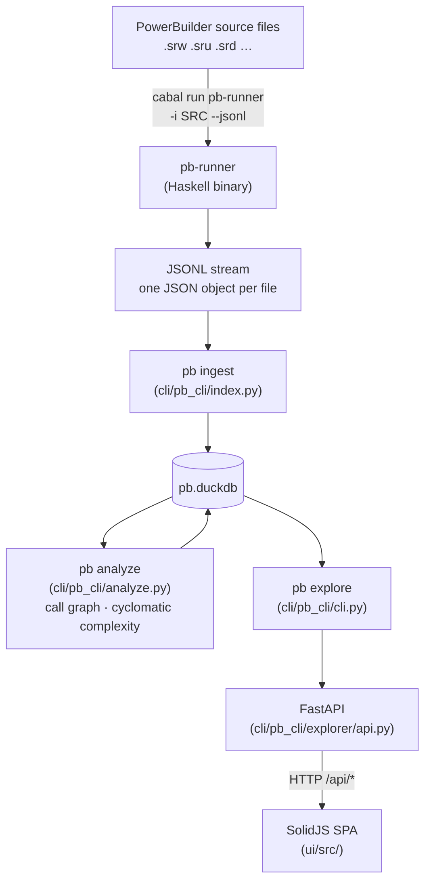
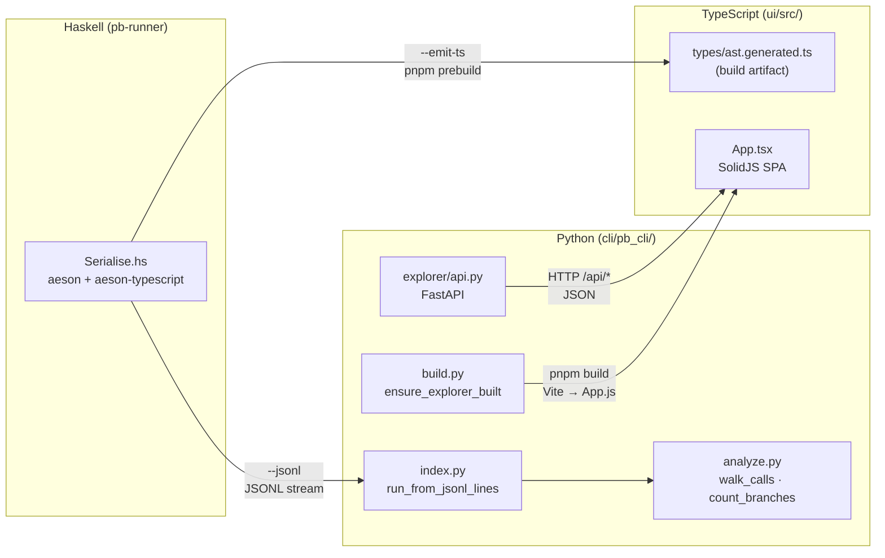

# Architecture

This repository contains three independent runtimes that form a pipeline:
**Haskell** parses PowerBuilder source files into JSON, **Python** ingests and
analyses that JSON, and **TypeScript** presents it as an interactive web UI.

---

## Component map

```
pb/
├── parser/                   Haskell parser (pb-ast)
│   ├── src/                  Library (PB.* modules)
│   ├── app/                  pb-runner executable
│   ├── test/                 Test suite
│   └── pb-ast.cabal          Cabal project configuration
├── cli/                      Python CLI tools
│   ├── pb_cli/               Python package (./pb or uv run --project cli pb_cli)
│   │   ├── cli.py            Entry point — all CLI sub-commands
│   │   ├── build.py          Build management: locate cabal binary, drive pnpm
│   │   ├── common.py         DuckDB schema (CREATE TABLE) + INSERT statements
│   │   ├── index.py          JSONL → DuckDB ingestion (pb ingest / pb index)
│   │   ├── analyze.py        Call graph metrics, cyclomatic complexity (pb analyze)
│   │   ├── diagram.py        GraphViz SVG generation (pb diagram)
│   │   ├── debt.py           BsRaw / ExRaw / DW coverage analyser (pb debt)
│   │   ├── queries.py        Auto-register queries/*.sql as `pb query` commands
│   │   ├── state.py          Incremental state tracking (file mtimes)
│   │   ├── pbl.py            .pbl extraction via powerbuilder-pbl-dump
│   │   └── explorer/         FastAPI backend (pb explore)
│   │       ├── api.py        FastAPI router — all /api/* endpoints
│   │       ├── app.py        App factory — mounts router + static files
│   │       ├── render.py     AST body_json → human-readable PBScript
│   │       └── static/       Served at /static/
│   │           ├── index.html  SPA shell page
│   │           ├── style.css
│   │           └── dist/     Vite build output (app.js) — not in git
│   ├── tests/                pytest test suite
│   ├── pyproject.toml        Python project configuration
│   └── uv.lock               Python dependency lockfile
├── ui/                       TypeScript / SolidJS SPA source
│   ├── src/
│   │   ├── App.tsx           SPA root component
│   │   ├── api-client.ts     Typed wrappers around /api/* endpoints
│   │   ├── components/       One file per UI panel (Objects, DataWindows, …)
│   │   └── types/
│   │       ├── api.ts              Hand-written API response shapes
│   │       ├── state.ts            SolidJS store shape
│   │       ├── actions.ts          Reducer action types
│   │       └── ast.generated.ts    Generated from Haskell — not in git
│   ├── tests/                Vitest test suite
│   ├── package.json          pnpm project (SolidJS, Vite, Vitest)
│   ├── vite.config.ts        Builds src/App.tsx → ../cli/pb_cli/explorer/static/dist/
│   └── tsconfig.json
├── pb                        Top-level wrapper: uv run --project cli pb_cli $*
├── doc/                      Documentation and planning
│   ├── plan/                 Planning artifacts (BACKLOG, STRATEGY, session plans)
│   ├── spec.md               Parser specification
│   └── pbl-spec.txt          PBL file format spec
├── queries/                  SQL files served as `pb query <name>` commands
└── example/                  Corpus data (openpay, openpay-src)
```

---

## Data flow



The Python layer never reads source files directly — it always consumes the
JSON emitted by `pb-runner`.

---

## Cross-component interfaces



### Haskell → TypeScript: `--emit-ts`

`pb-runner --emit-ts` uses `aeson-typescript` to derive TypeScript type
definitions directly from the Haskell AST types and prints them to stdout.
The `prebuild` npm script writes this output to
`src/types/ast.generated.ts` each time `pnpm build` is invoked:

```json
"prebuild": "cabal run --project-dir ../parser pb-runner -v0 -- --emit-ts > src/types/ast.generated.ts"
```

`ast.generated.ts` is a build artifact (not committed to git) that emits
`export type` / `export interface` declarations.  It is imported by
`ui/src/types/state.ts`, `actions.ts`, `core.ts`, `api-client.ts`, and
`components/Explore.tsx` to type the `BodyStmt[]` AST payloads flowing
through the explore API.

### Haskell → Python: JSONL

`pb-runner -i SRC_DIR --jsonl` prints one JSON object per file to stdout.
`cli/pb_cli/index.py:run_from_jsonl_lines` reads this stream and populates
DuckDB.  The JSON encoding follows `genericToJSON` conventions:

| Shape | Haskell | JSON |
|-------|---------|------|
| sum type, single-value constructor | `BsReturn (Maybe Expr)` | `{"tag":"BsReturn","contents": …}` |
| sum type, record constructor | `ExBinOp` with `lhs`, `op`, `rhs` | `{"tag":"ExBinOp","lhs":…,"op":…,"rhs":…}` |
| sum type, nullary constructor | `BsExit` | `{"tag":"BsExit"}` |
| product type (record) | `Lvalue {segments}` | `{"segments":[…]}` |

Tag strings are Haskell constructor names verbatim (`"BsIf"`, `"ExCall"`,
`"DwRetrieveOk"` — **not** short forms like `"if"` or `"ok"`).  Any Python
or TypeScript code that pattern-matches on these strings must use the full
constructor name.

### Python → TypeScript: static files

`cli/pb_cli/build.py:ensure_explorer_built` calls `pnpm build` (with
`--frozen-lockfile install` first if `node_modules` is absent).  `pnpm build`
runs `prebuild` (emits TypeScript types) then Vite, writing
`static/dist/App.js`.  The FastAPI app mounts `static/` at `/static/`.

Staleness is determined by comparing the mtime of `cli/pb_cli/explorer/static/dist/app.js`
against `ui/src/**/*.ts`, `ui/src/**/*.tsx`, `ui/package.json`, and `ui/vite.config.ts`.

### TypeScript → FastAPI: HTTP

`src/api-client.ts` issues typed `fetch` calls to `/api/*` endpoints.
`src/types/api.ts` hand-documents the response shapes.  There is no code
generation for the API contract — changes to `api.py` must be reflected in
`api.ts` manually.

---

## Key files by concern

| Concern | File(s) |
|---------|---------|
| Parsing PowerBuilder syntax | `parser/src/PB/Lexing/`, `parser/src/PB/Grammar/` |
| AST data types | `parser/src/PB/AST/` |
| JSON serialisation + TS codegen | `parser/src/PB/Pipeline/Serialise.hs` |
| CLI entry point (Haskell) | `parser/app/Main.hs` |
| DuckDB schema | `cli/pb_cli/common.py` |
| JSON → DuckDB ingestion | `cli/pb_cli/index.py` |
| Call graph + cyclomatic complexity | `cli/pb_cli/analyze.py` |
| FastAPI endpoints | `cli/pb_cli/explorer/api.py` |
| AST → PBScript rendering | `cli/pb_cli/explorer/render.py` |
| Explorer build orchestration | `cli/pb_cli/build.py:ensure_explorer_built` |
| SPA root | `ui/src/App.tsx` |
| SPA state | `ui/src/store.ts` |
| Generated AST types (TS) | `ui/src/types/ast.generated.ts` (build artifact; `pnpm prebuild` regenerates) |
| SQL query commands | `queries/*.sql` |

---

## Testing

| Layer | Command | Location |
|-------|---------|----------|
| Haskell | `cabal test` (in `parser/`) | `parser/test/` |
| Python | `uv run pytest` (in `cli/`) | `cli/tests/` |
| TypeScript | `pnpm test` (in `ui/`) | `ui/tests/` |
| Debt gate | `uv run --project cli pb_cli debt` | checks ExRaw, BsRaw, DW coverage |

Haskell tests include corpus oracle tests (`test/CorpusDebtTest.hs`,
`test/CorpusInvariantTest.hs`) that gate on zero corpus errors and ratcheted
ExRaw/BsRaw counts.

---

## Build sequence (fresh checkout)

```bash
# 1. Build and test Haskell
cd parser && cabal build && cabal test

# 2. Install Python deps
cd cli && uv sync

# 3. Run pb ingest to populate pb.duckdb
./pb ingest example/openpay

# 4. Start the explorer (auto-builds TS on first run)
./pb explore
```

---

## Common gotchas

**Tag names use Haskell constructor names.**  After the plan-36 serialise
rewrite (`6fa3e1a`), tag strings are full constructor names (`"BsIf"`,
`"ExCall"`, `"DwRetrieveOk"`).  Short forms (`"if"`, `"call_expr"`, `"ok"`)
no longer appear in any JSON output.  Python code that checks `node["tag"]`
must use the full name.

**`contents` wrapping.**  Single-value constructors always put their payload
under `"contents"`.  Record constructors put fields at the same level as
`"tag"`.  There is no way to tell from the tag name alone — consult
`parser/src/PB/Pipeline/Serialise.hs` or `ui/src/types/ast.generated.ts`.

**`ast.generated.ts` is not in git.**  It is regenerated by `pnpm prebuild`
on every `pnpm build`.  If TypeScript compilation fails on a clean checkout,
run `pnpm run codegen` (or `pnpm build`) to create it.

**`pb.duckdb` is a local artefact.**  Tests must never reuse a root-level
`pb.duckdb`; each test fixture that needs a database should create a fresh
temp file.  The explorer test fixture (`test_explorer.py`) and index test
fixture (`test_index.py`) both do this.
