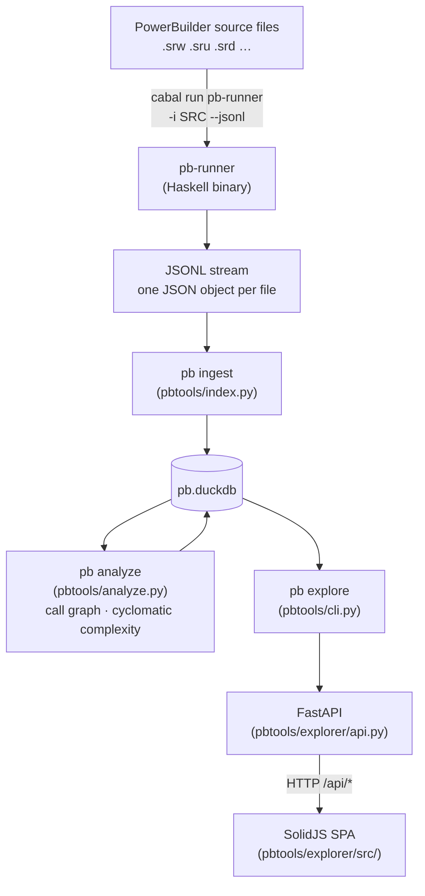
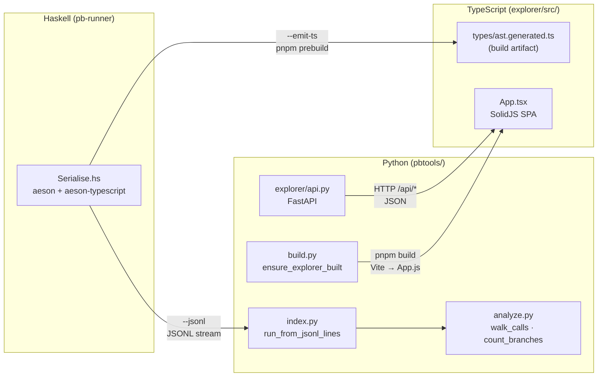

# Architecture

This repository contains three independent runtimes that form a pipeline:
**Haskell** parses PowerBuilder source files into JSON, **Python** ingests and
analyses that JSON, and **TypeScript** presents it as an interactive web UI.

---

## Component map

```
pb/
├── src/ app/ test/         Haskell library + executable + tests
├── pb-ast.cabal            Cabal project configuration
├── pyproject.toml          uv Python project configuration
├── pbtools/                Python tooling package  (uv run pb …)
│   ├── cli.py              Entry point — all `pb` CLI sub-commands
│   ├── build.py            Build management: locate cabal binary, drive pnpm
│   ├── common.py           DuckDB schema (CREATE TABLE) + INSERT statements
│   ├── index.py            JSONL → DuckDB ingestion (pb ingest / pb index)
│   ├── analyze.py          Call graph metrics, cyclomatic complexity (pb analyze)
│   ├── diagram.py          GraphViz SVG generation (pb diagram)
│   ├── debt.py             BsRaw / ExRaw / DW coverage analyser (pb debt)
│   ├── queries.py          Auto-register queries/*.sql as `pb query` commands
│   ├── state.py            Incremental state tracking (file mtimes)
│   ├── pbl.py              .pbl extraction via powerbuilder-pbl-dump
│   └── explorer/           FastAPI backend + SolidJS frontend (pb explore)
│       ├── api.py          FastAPI router — all /api/* endpoints
│       ├── app.py          App factory — mounts router + static files
│       ├── render.py       AST body_json → human-readable PBScript
│       ├── static/         Served at /static/
│       │   ├── index.html  SPA shell page
│       │   ├── style.css
│       │   └── dist/       Vite build output (App.js) — not in git
│       ├── src/            TypeScript / SolidJS source — not in git after build
│       │   ├── App.tsx     SPA root component
│       │   ├── api-client.ts  Typed wrappers around /api/* endpoints
│       │   ├── components/ One file per UI panel (Objects, DataWindows, …)
│       │   └── types/
│       │       ├── api.ts          Hand-written API response shapes
│       │       ├── state.ts        SolidJS store shape
│       │       ├── actions.ts      Reducer action types
│       │       └── ast.generated.ts  Generated from Haskell — not in git
│       ├── package.json    pnpm project (SolidJS, Vite, Vitest)
│       └── vite.config.ts  Builds src/App.tsx → static/dist/App.js
├── queries/                SQL files served as `pb query <name>` commands
├── pytests/                pytest test suite for Python tools
├── example/                Corpus data (openpay, openpay-src)
├── reference/              SPEC.md + Appeon docs (markdown)
└── plan/                   Planning artifacts (BACKLOG, STRATEGY, session plans)
```

> **Planned restructuring:** `pbtools/explorer/src/` (and `package.json`,
> `vite.config.ts`, `tests/`) will be extracted to a top-level `ui/` directory.
> The Vite output path will continue to target `pbtools/explorer/static/dist/`
> so the Python serving layer is unchanged.  Track this in BACKLOG.

---

## Data flow



The Python layer never reads source files directly — it always consumes the
JSON emitted by `pb-runner`.

---

## Cross-component interfaces



### Haskell → TypeScript: `--emit-ts`

`pb-runner --emit-ts` uses `aeson-typescript` to derive TypeScript type
definitions directly from the Haskell AST types and prints them to stdout.
The `prebuild` npm script writes this output to
`src/types/ast.generated.ts` each time `pnpm build` is invoked:

```json
"prebuild": "cabal run --project-dir ../.. pb-runner -v0 -- --emit-ts > src/types/ast.generated.ts"
```

`ast.generated.ts` is a build artifact — it is not committed to git and not
imported by anything yet, but it is available for typed access to parsed AST
data returned by the API.

### Haskell → Python: JSONL

`pb-runner -i SRC_DIR --jsonl` prints one JSON object per file to stdout.
`pbtools/index.py:run_from_jsonl_lines` reads this stream and populates
DuckDB.  The JSON encoding follows `genericToJSON` conventions:

| Shape | Haskell | JSON |
|-------|---------|------|
| sum type, single-value constructor | `BsReturn (Maybe Expr)` | `{"tag":"BsReturn","contents": …}` |
| sum type, record constructor | `ExBinOp` with `lhs`, `op`, `rhs` | `{"tag":"ExBinOp","lhs":…,"op":…,"rhs":…}` |
| sum type, nullary constructor | `BsExit` | `{"tag":"BsExit"}` |
| product type (record) | `Lvalue {segments}` | `{"segments":[…]}` |

Tag strings are Haskell constructor names verbatim (`"BsIf"`, `"ExCall"`,
`"DwRetrieveOk"` — **not** short forms like `"if"` or `"ok"`).  Any Python
or TypeScript code that pattern-matches on these strings must use the full
constructor name.

### Python → TypeScript: static files

`pbtools/build.py:ensure_explorer_built` calls `pnpm build` (with
`--frozen-lockfile install` first if `node_modules` is absent).  `pnpm build`
runs `prebuild` (emits TypeScript types) then Vite, writing
`static/dist/App.js`.  The FastAPI app mounts `static/` at `/static/`.

Staleness is determined by comparing the mtime of `static/dist/app.js`
against `src/**/*.ts`, `src/**/*.tsx`, `package.json`, and `vite.config.ts`.

### TypeScript → FastAPI: HTTP

`src/api-client.ts` issues typed `fetch` calls to `/api/*` endpoints.
`src/types/api.ts` hand-documents the response shapes.  There is no code
generation for the API contract — changes to `api.py` must be reflected in
`api.ts` manually.

---

## Key files by concern

| Concern | File(s) |
|---------|---------|
| Parsing PowerBuilder syntax | `src/PB/Lexing/`, `src/PB/Grammar/` |
| AST data types | `src/PB/AST/` |
| JSON serialisation + TS codegen | `src/PB/Pipeline/Serialise.hs` |
| CLI entry point (Haskell) | `app/Main.hs` |
| DuckDB schema | `pbtools/common.py` |
| JSON → DuckDB ingestion | `pbtools/index.py` |
| Call graph + cyclomatic complexity | `pbtools/analyze.py` |
| FastAPI endpoints | `pbtools/explorer/api.py` |
| AST → PBScript rendering | `pbtools/explorer/render.py` |
| Explorer build orchestration | `pbtools/build.py:ensure_explorer_built` |
| SPA root | `pbtools/explorer/src/App.tsx` |
| SPA state | `pbtools/explorer/src/store.ts` |
| Generated TS types | `pbtools/explorer/src/types/ast.generated.ts` |
| SQL query commands | `queries/*.sql` |

---

## Testing

| Layer | Command | Location |
|-------|---------|----------|
| Haskell | `cabal test` | `test/` |
| Python | `uv run pytest` | `pytests/` |
| TypeScript | `pnpm test` (in `pbtools/explorer/`) | `pbtools/explorer/tests/` |
| Corpus regression | `bash scripts/check-corpus.sh` | uses `example/openpay` |
| Debt gate | `uv run pb debt` | checks ExRaw, BsRaw, DW coverage |

Haskell tests include corpus oracle tests (`test/CorpusDebtTest.hs`,
`test/CorpusInvariantTest.hs`) that gate on zero corpus errors and ratcheted
ExRaw/BsRaw counts.

---

## Build sequence (fresh checkout)

```bash
# 1. Build and test Haskell
cabal build && cabal test

# 2. Install Python deps
uv sync

# 3. Run pb ingest to populate pb.duckdb
uv run pb ingest example/openpay

# 4. Start the explorer (auto-builds TS on first run)
uv run pb explore
```

---

## Common gotchas

**Tag names use Haskell constructor names.**  After the plan-36 serialise
rewrite (`6fa3e1a`), tag strings are full constructor names (`"BsIf"`,
`"ExCall"`, `"DwRetrieveOk"`).  Short forms (`"if"`, `"call_expr"`, `"ok"`)
no longer appear in any JSON output.  Python code that checks `node["tag"]`
must use the full name.

**`contents` wrapping.**  Single-value constructors always put their payload
under `"contents"`.  Record constructors put fields at the same level as
`"tag"`.  There is no way to tell from the tag name alone — consult
`src/PB/Pipeline/Serialise.hs` or `src/types/ast.generated.ts`.

**`ast.generated.ts` is not in git.**  It is regenerated by `pnpm prebuild`
on every `pnpm build`.  If TypeScript compilation fails on a clean checkout,
run `pnpm run codegen` (or `pnpm build`) to create it.

**`pb.duckdb` is a local artefact.**  Tests must never reuse a root-level
`pb.duckdb`; each test fixture that needs a database should create a fresh
temp file.  The explorer test fixture (`test_explorer.py`) and index test
fixture (`test_index.py`) both do this.
