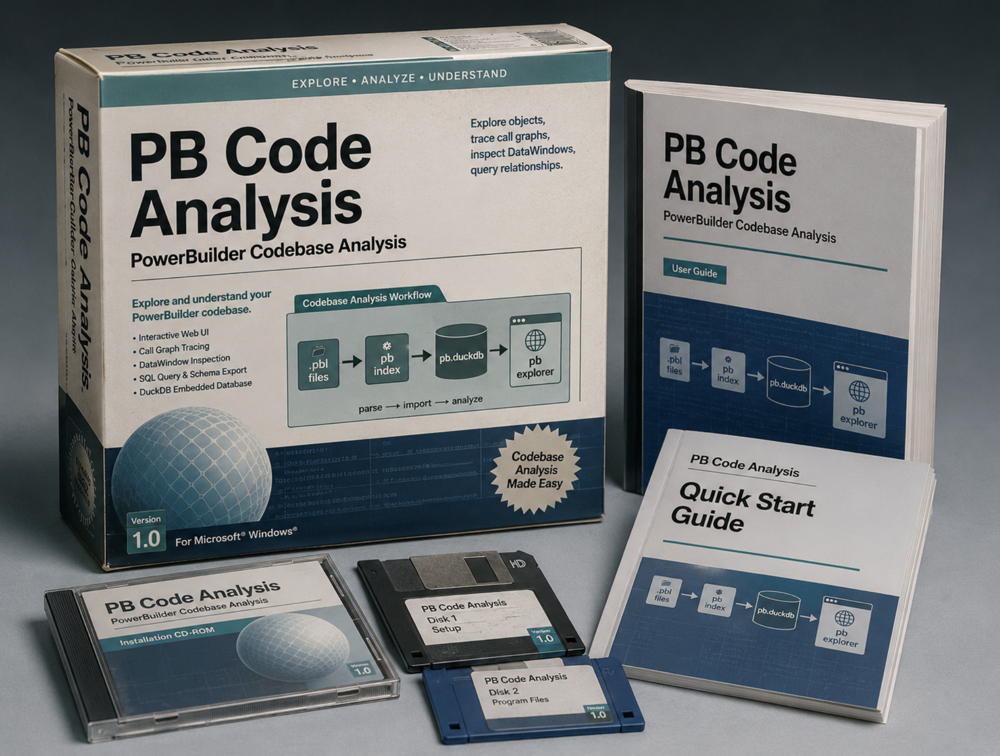

# pb

[](https://github.com/thomasmarsh/pb/actions/workflows/ci.yml)
[](LICENSE)

Analyze PowerBuilder codebases through an interactive web UI — browse objects, trace call graphs, inspect DataWindows, and query relationships. Backed by a DuckDB database, you can also run SQL directly or hand the schema to an LLM.

<p align="center">
  
</p>
<p align="center"><em>What we're working with.</em></p>

## Quick start

**Prerequisites:** [GHCup](https://www.haskell.org/ghcup/) (GHC + Cabal), [pnpm](https://pnpm.io/), and [uv](https://docs.astral.sh/uv/).

```bash
# Index and explore in one step — builds parser, indexes, opens browser
./pb explore /path/to/src
```

Or separately:

```bash
./pb index /path/to/src       # parse → import → analyze (incremental)
./pb explore                  # open browser (reuses existing pb.duckdb)
```

The Haskell parser is built automatically on first run. Subsequent runs only re-parse files whose content has changed.

Input can be a directory of `.sr*` source files, a single `.pbl` library, or a directory of `.pbl` files — extraction happens transparently.

## CLI

| Command                 | Description                                                 |
| ----------------------- | ----------------------------------------------------------- |
| `pb index DIR`          | Parse, import, and analyze a source tree (incremental)      |
| `pb explore [DIR]`      | Start the web UI; index `DIR` first if given                |
| `pb extract DIR -o OUT` | Extract `.pbl` files to per-library directories             |
| `pb dead-code [DB]`     | List non-public procedures unreachable from entry points    |
| `pb impact TABLE [COL]` | Show all PB objects affected by a DB table/column change    |
| `pb query NAME [DB]`    | Run a canned SQL query against the database                 |
| `pb analyze [DB]`       | Re-run graph metrics on an existing database                |
| `pb check-corpus`       | Verify both corpora parse with zero errors                  |
| `pb clean`              | Remove build artifacts (cabal, node_modules, Python caches) |

Common flags: `--db FILE` (default `pb.duckdb`), `--reset` (full re-parse), `--ddl [SCHEMA:]FILE` (DDL catalog, repeatable), `--sql-dialect DIALECT` (default `oracle`), `--default-namespace NS`.

## Explorer

The interactive explorer is a SolidJS SPA backed by FastAPI and DuckDB.

| View        | Description                                               |
| ----------- | --------------------------------------------------------- |
| Dashboard   | Codebase overview — metrics, charts, health               |
| Objects     | Browse all parsed objects with detail views               |
| Procedures  | Functions, subroutines, events — full AST body rendering  |
| DataWindows | Controls, bands, retrieval args, SQL lineage              |
| Tables      | Database tables referenced by DataWindows                 |
| Diagrams    | Inheritance, call graphs, DW-table dependencies, heatmaps |
| Queries     | Run canned SQL queries or write your own                  |
| Search      | Full-text search across objects and procedures            |
| Explore     | Write and run ad-hoc SQL against the database             |

## File types

| Extension | Object type | Notes |
| --------- | ----------- | ----- |
| `.srw` | Window | PowerScript |
| `.srs` | Structure | PowerScript |
| `.sru` | UserObject | PowerScript |
| `.srf` | Function | PowerScript |
| `.srm` | Menu | PowerScript |
| `.sra` | Application | PowerScript |
| `.srp` | Pipeline | Data pipeline / ETL |
| `.srj` | Project | Build configuration |
| `.srd` | DataWindow | Separate parser (different syntax) |

## Further reading

- **[`doc/architecture.md`](doc/architecture.md)** — component map, data flow, cross-component interfaces, testing, and build sequence.
- **[`doc/vision.md`](doc/vision.md)** — architectural rationale, LLM integration workflow, DuckDB schema design, and the full operational pipeline.
- **[`doc/spec.md`](doc/spec.md)** — parser specification: lexical rules, token forms, file structure, and DataWindow syntax.
- **[`doc/development.md`](doc/development.md)** — build overview, test commands, adding queries, and corpus/debt analysis.
- **`CLAUDE.md`** — development protocol: staged verification loop, corpus gates, module placement guide, and code index.

## License

[BSD-3-Clause](LICENSE) — Copyright (c) 2026, Thomas Marsh
