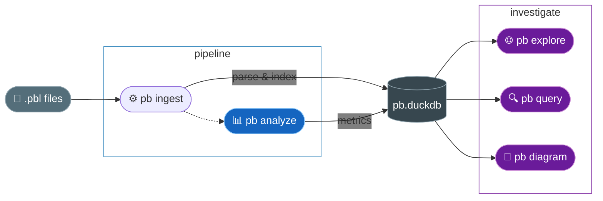

# PowerBuilder Codebase Analysis

[](https://github.com/thomasmarsh/pb/actions/workflows/ci.yml)

Parse a legacy PowerBuilder source tree into a DuckDB relational database
you can query with plain SQL, or hand to an LLM as a tool. This avoids
the need for grepping or manual reading.



---

## Quick start

```bash
# 1. Install Python tooling (also builds the Haskell parser on first use)
cd cli && uv sync

# 2. Parse, index, and analyze in one command — incremental by default
./pb ingest /path/to/src

# 3. Query
./pb query top              # most complex procedures
./pb query pagerank         # most important objects
./pb query --help           # full command list

# 4. Explore interactively
./pb explore                # builds frontend on first run, opens browser
```

On the first run `pb ingest` builds the Haskell parser automatically. Every
subsequent run only re-parses files whose content has changed — unchanged
files are skipped instantly.

`-i` accepts a directory of `.sr*` source files, a single `.pbl` library
file, or a directory of `.pbl` files — extraction happens transparently,
no separate `pb extract` step required.

`pb.duckdb` now contains every object, procedure, DataWindow
control, database reference, and inheritance edge in your codebase.

### Modes

| Command                      | What it does                                                    |
| ---------------------------- | --------------------------------------------------------------- |
| `pb ingest DIR [--db DB]`    | Parse → index → analyze (incremental). Default DB: `pb.duckdb`. |
| `pb ingest DIR --reset`      | Full re-parse, drop and recreate all tables.                    |
| `pb dump DIR -o OUTDIR`      | Parse to a mirrored JSON file tree (one-shot snapshot).         |
| `pb analyze [DB]`            | Re-run graph metrics on an existing database.                   |
| `pb explore [--db DB]`       | Interactive web UI (auto-builds frontend on first run).         |

All commands accept `.pbl` inputs directly — source extraction is automatic.

`pb ingest` prints a progress bar while parsing, shows rich error panels for any
files that fail (with source context), and reports a summary on stderr.

---

## Explorer (web UI)

The interactive explorer is a TypeScript SPA served by FastAPI.
`pb explore` auto-builds the frontend on first run (like the Haskell parser):

```bash
# Serve the explorer (auto-builds frontend + opens browser)
./pb explore

# Or explicitly:
./pb explore --db pb.duckdb --port 8000
```

### Frontend development

```bash
cd ui
pnpm install
pnpm dev              # Vite dev server with HMR on :5173
pnpm typecheck        # tsc --noEmit
pnpm test             # vitest (39 reducer tests)
pnpm build            # compile TS → static/dist/
```

---

## Build overview

| Component        | Command                                    | What it does                         |
| ---------------- | ------------------------------------------ | ------------------------------------ |
| Haskell parser   | `cd parser && cabal build`                 | Compile library + executables        |
| Haskell tests    | `cd parser && cabal test`                  | Run 768 property + unit tests        |
| Python tools     | `./pb ingest`                              | Parse → index → analyze pipeline     |
| Python tests     | `cd cli && uv run pytest`                  | 125 tests across tooling             |
| Explorer TS      | `pnpm build` (in `ui/`)                    | Bundle TS → JS for the web UI        |
| Explorer tests   | `pnpm test` (in `ui/`)                     | 39 reducer + state management tests  |
| Corpus check     | `./pb check-corpus`                        | 0 errors / 777 files baseline        |

CI runs all of these on every push to `main`.

---

## Fact tables

| Table                 | Rows (example)                               | What's in it                                                    |
| --------------------- | -------------------------------------------- | --------------------------------------------------------------- |
| `objects`             | one per source file                          | name, kind (`powerscript`/`datawindow`), declared ancestor      |
| `procedures`          | functions + subroutines + events + on-blocks | name, modifiers, params, return type, start/end line, body JSON |
| `inherits`            | one per ancestor declaration                 | `from_object → to_object` edges                                 |
| `calls`               | call graph edges                             | `object → to_name`, call type; populated by `pb analyze`        |
| `object_metrics`      | one per object                               | PageRank, betweenness, in/out degree, max cyclomatic, DIT       |
| `dw_controls`         | one per DataWindow control                   | type, band, x/y/width/height, expression, tab order             |
| `dw_retrieve_tables`  | one per table referenced in PBSELECT         | which DataWindow reads which DB table                           |
| `dw_retrieve_columns` | one per column in SELECT list                | fully-qualified `table.column`                                  |
| `dw_retrieve_where`   | one per WHERE clause condition               | `exp1 op exp2 logic`                                            |
| `dw_arguments`        | one per retrieval argument                   | name, type                                                      |

---

## Queries

Built-in commands cover the most common analyses — no SQL required:

```bash
./pb query top                              # most complex procedures
./pb query pagerank                         # most important objects by PageRank
./pb query callers fn_sqlerror             # who calls this function
./pb query dead-code                        # uncalled non-public procedures
./pb query god-objects                      # high fan-in + high complexity
./pb query ancestors m_misth_zpstath_grid  # inheritance chain upward
./pb query descendants w_list              # all objects extending w_list
./pb query dw dw_misth_ypal_yvar_list      # tables/columns for a DataWindow
./pb query db-coverage                     # all referenced database tables
./pb query coupling                        # most tightly coupled object pairs
```

Most commands accept `--n` to change the row limit and `--db` to target a
different database file. Run `./pb <command> --help` for details.

### Adding queries

Drop a `.sql` file into `queries/` and it becomes a `pb` command automatically.
The leading comment block sets the description and parameters:

```sql
-- One-line description shown in pb --help.
-- :name TEXT          ← required positional argument
-- :n INT 20           ← optional --n flag with default 20
SELECT ...
WHERE col = $name
LIMIT $n;
```

### Ad-hoc SQL

For queries not covered by the built-ins, open a DuckDB shell directly:

```bash
duckdb pb.duckdb
```

```sql
-- Procedures larger than N lines
SELECT object, proc_type, name, start_line, end_line,
       (end_line - start_line) AS line_count
FROM procedures
WHERE end_line IS NOT NULL
ORDER BY line_count DESC
LIMIT 20;

-- DataWindows with parameterised retrieval
SELECT da.dw_name, da.arg_name, da.arg_type,
       string_agg(dw.exp1 || ' ' || dw.op || ' ' || dw.exp2, ' AND ') AS where_clause
FROM dw_arguments da
JOIN dw_retrieve_where dw ON dw.dw_name = da.dw_name
GROUP BY da.dw_name, da.arg_name, da.arg_type
ORDER BY da.dw_name;

-- Objects with the deepest inheritance tree
SELECT object, dit FROM object_metrics
WHERE dit IS NOT NULL ORDER BY dit DESC LIMIT 10;
```

---

## Diagrams

Requires `pb.duckdb` populated via `pb ingest` (or `pb analyze` standalone).

```bash
# Inheritance hierarchy (all objects)
./pb diagram inheritance -o inheritance.svg

# Call ego-graph centred on a high-PageRank object
./pb diagram calls --object nvo_validation --depth 2 -o calls.svg

# DataWindow → DB table bipartite dependency graph
./pb diagram dw-tables -o dw_tables.svg

# Complexity heatmap (all objects, size = fan-in, colour = cyclomatic)
./pb diagram heatmap -o heatmap.svg

# Emit raw DOT source for any diagram (pipe to dot or graphviz tools)
./pb diagram inheritance --dot | dot -Tpng > inheritance.png
```

---

## Debt analysis

Measure how much of the AST is still in raw fallback form (unclassified
statements and expressions). Useful for tracking parser coverage.

```bash
./pb debt --no-build   # skips cabal build if pb-runner is already fresh
```

---

## Parser coverage check

```bash
./pb check-corpus   # 0 errors / 777 files = baseline
```

---

## File types parsed

| Extension | Object type      |
| --------- | ---------------- |
| `.srw`    | Application      |
| `.srs`    | Window           |
| `.sru`    | UserObject       |
| `.srf`    | Function         |
| `.srm`    | Menu             |
| `.srd`    | DataWindow       |
| `.sra`    | Structure        |
| `.sro`    | Object (generic) |

---

## Further reading

- **`[architecture.md](doc/architecture.md)`** — component map, data flow, cross-component
  interfaces, testing, and build sequence.
- **`[vision.md](doc/vision.md)`** — architectural rationale, LLM integration workflow,
  DuckDB schema design, and the full operational pipeline.
- **`[skills-draft.md](doc/skills-draft.md)`** — draft of a skills file that could be used for generating new queries
- **`CLAUDE.md`** — development protocol: staged verification loop, corpus
  gates, module placement guide, and code index.
