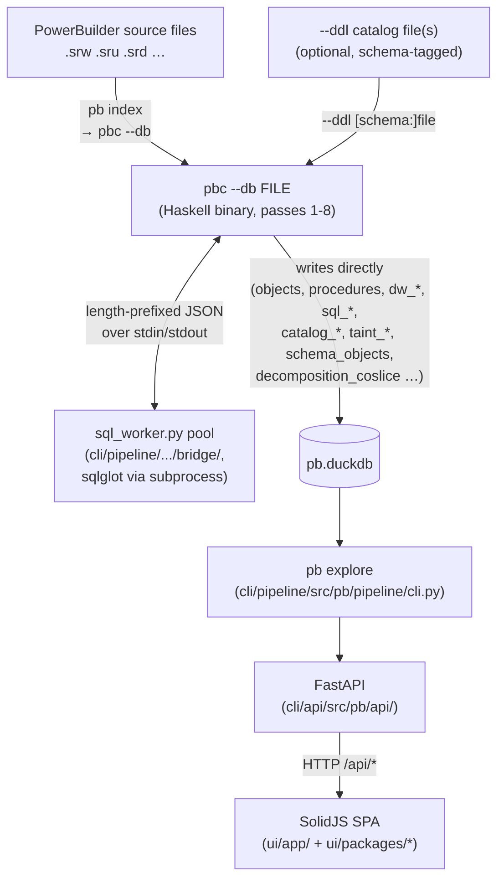
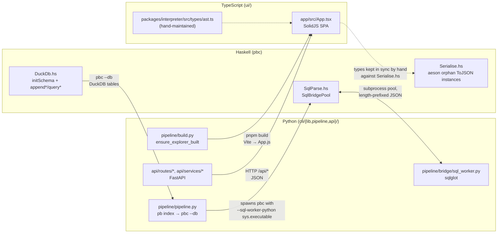

# Architecture

This repository contains three independent runtimes that form a pipeline:
**Haskell** parses PowerBuilder source files and runs all analysis passes,
**Python** drives orchestration and presents data via FastAPI, and
**TypeScript** renders the interactive web UI (a pnpm workspace of four
packages plus the SPA shell).

`pb index` drives `pbc --db FILE`: Haskell writes all analysis results
(procedures, call resolution, taint, dead code, DW/SQL schema category,
decomposition candidates) directly to DuckDB. Python reads but never
writes the analysis tables.

`pbc` also shells out *to* Python for SQL dialect handling: every embedded
SQL statement and every `--ddl`-supplied DDL catalog file is sent over a
subprocess bridge to a pool of `sql_worker.py` processes wrapping
`sqlglot` (see "Haskell ↔ Python: SQL/DDL bridge" below).

There is no code-generation step between Haskell and TypeScript. AST wire
types are hand-maintained on both sides (see "Common gotchas" below).

---

## Component map

```
pb/
├── compiler/                   Haskell parser + analysis engine (pb-compiler)
│   ├── src/PB/
│   │   ├── AST/               Data types only (Located, Expr, BodyStmt, Type, SourceFile, DataWindow)
│   │   ├── Lexing/            Tokenization, layout, string mode
│   │   ├── Grammar/           megaparsec parsers (Body, File, Stream, DataWindow)
│   │   ├── Pipeline/          Preprocess, Emit, Passes, Runner, Serialise, FileWalk, DuckDb, SqlParse
│   │   ├── Analysis/          Cfg, Dataflow, Taint, TypeEnv/TypeResolve, CatOp/CatLower/GraphBuilder,
│   │   │                      SchemaCategory, SchFootprint (categorical IR + DB-schema-as-category)
│   │   └── Prelude.hs         Custom Prelude — no String, no partial functions
│   ├── app/Main.hs             pbc executable — flag parsing + dispatch only
│   ├── test/                   Test suite (HUnit + Hedgehog, corpus oracle tests)
│   └── pb-compiler.cabal
├── cli/                       Python workspace (uv), three packages — see doc/architecture-cli.md
│   ├── lib/src/pb/lib/         Pure data transforms, zero I/O
│   ├── pipeline/src/pb/pipeline/  Imperative boundary: pbc invocation, DuckDB, CLI commands
│   │   ├── commands/           check-corpus, clean, dead-code, bombadil (dev) sub-commands
│   │   └── bridge/             sql_worker.py — SQL/DDL parsing subprocess, spawned directly by pbc
│   ├── api/src/pb/api/         FastAPI web layer
│   │   ├── routes/             Thin endpoint handlers (one module per concern)
│   │   ├── services/           Business logic called by routes
│   │   └── static/dist/        Vite build output (App.js) — not in git; served at /static/
│   ├── lib/tests/, pipeline/tests/, api/tests/   pytest suites (per-package)
│   └── pyproject.toml + uv.lock (workspace root)
├── ui/                        TypeScript pnpm workspace — SolidJS
│   ├── packages/
│   │   ├── core/               Framework primitives: Reducer/Effect/Store, job-poll (async diagram jobs)
│   │   ├── interpreter/        PB runtime interpreter: instr-graph execution, DataWindow layout/render
│   │   ├── platform/           Feature reducers + shared components + API types (the bulk of the app)
│   │   └── windowing/          MDI-style window manager (launch/manager/runner reducers)
│   ├── app/                    SPA shell — imports all four packages
│   │   └── src/
│   │       ├── App.tsx         Root component
│   │       ├── state.ts / actions.ts / reducer.ts / api-client.ts   App-level wiring
│   │       └── views/features/ Per-feature view components (analysis, dashboard, datawindows,
│   │                            diagrams, errors, explore, launch, library, navigation, objects,
│   │                            queries, search, tables)
│   ├── tests/                  Vitest suite for the SPA shell
│   ├── pnpm-workspace.yaml, package.json, vite.config.ts, vitest.config.ts (workspace root)
│   └── bombadil-spec.ts        Temporal-logic PBT spec (see doc/bombadil.md)
├── pb                          Top-level wrapper: uv run --project cli pb $*
├── doc/                        Documentation and planning
│   ├── plan/                  Planning artifacts (BACKLOG, STRATEGY, session plans) — gitignored
│   ├── spec.md                Parser specification
│   └── pbl-spec.txt           PBL file format spec
├── queries/                    SQL files served as `pb query <name>` commands
└── example/                    Corpus data (openpay-0.1.1b, PowerBuilder-Example)
```

---

## Data flow



The Python layer never reads source files directly, and never re-derives
analysis results Haskell already computed. `pb index` shells out to `pbc
--db`, so Haskell owns parsing and all downstream static-analysis passes
(dataflow, taint, call resolution, dead code, the DB-schema-as-category
model); `pbc` in turn calls back into a pool of Python subprocess workers
for SQL/DDL dialect parsing via `sqlglot`. Python's own computational work
otherwise is limited to incremental re-run bookkeeping (`metadata` table,
source hashing) and NetworkX graph metrics (`object_metrics` — PageRank,
betweenness, DIT).

---

## Schema category (`Sch`): the unified statement-footprint cospan

`compiler/src/PB/Analysis/SchemaCategory.hs` models the database schema as
a category: objects are `SchObject = ColumnObj TableRef Text | StmtObj
StmtId`, and morphisms (`SchMorphism`) are the "legs" a statement has into
the columns it reads or writes. `StmtId` is a **tag on top of a shared
object type** marking which front-end produced the statement
(`SqlStmtId` for PowerScript embedded SQL, `DwRetrieveId` for a DataWindow
retrieve) — DataWindow and PowerScript are not separately-engineered
schema relationships, they are two legs of a cospan converging on the same
`Sch` codomain:

```
CatOp --Fps--> Sch <--Fdw-- DwRetrieve
```

- `Fps` is `PB.Analysis.SchFootprint`'s `foldSchFootprint`, a second
  instance of `PB.Analysis.CatOp`'s `Category`/`Cartesian`/`Cocartesian`/
  `Effectful` typeclasses (alongside `CatInterp`'s direct-execution
  instance) — it folds a compiled `CatOp` term straight into `Set
  SchMorphism`, with no separate walker. It complements, not replaces, the
  sqlglot-text leg producer (`querySqlCols`) that reads literal embedded
  `SELECT`/`INSERT`/`UPDATE`/`DELETE` text — `Fps` alone reaches
  dynamic-dispatch writes sqlglot cannot see (e.g. a DataWindow
  `SetItem(row, "col", value)` call resolved through `ControlHierarchy`'s
  static control/DW bindings).
- `Fdw` is `PB.Analysis.DwFootprint.dwRetrieveFootprint`, a total,
  control-flow-free walk over an already-parsed `DwTable` (column list,
  update-table, WHERE-predicate `Expr` tree, joins) into the same `Set
  SchMorphism` codomain. A DW retrieve is deliberately **not** compiled
  through `CatOp` — it has no procedure body to give it a CFG, so forcing
  it through the imperative `CatOp` GADT would be a false unification of
  the vehicle when only the destination (`Sch`) needs to be shared.

Both legs are independent domains and independent functors; the only thing
that unifies is the destination type and the materialization/read path.
`Pass 9` (`PB.Pipeline.Passes.runPass9`, calling
`SchemaCategory.buildSchema`) combines every leg producer — DW-retrieve,
DW-join, DW-write, DW-WHERE, sqlglot-text, `SchFootprint`/`CatOp`, and
DDL-derived FK legs — into one `SchGraph`, written to shared
`schema_objects`/`schema_morphisms` DuckDB tables. Every `schema_morphisms`
row carries a `leg_source` column (`"sql_text"`, `"cat_footprint"`,
`"dw_retrieve"`, `"dw_join"`, `"dw_where"`, `"ddl_fk"`) — orthogonal to the
`StmtId` front-end tag — recording which analysis *technique* found that
touch, since one statement can accumulate legs from more than one
technique. `Pass 10`'s `columnCoslice` (blast radius / validation walk,
written to `decomposition_coslice`) traverses this graph
source-agnostically — a column's "who touches this" answer is already
front-end-blind by construction.

On the read side, `GET /api/schema/footprint/{object_name}`
(`cli/api/src/pb/api/routes/schema.py`) and the SPA's `FootprintPanel`
(`ui/app/src/views/features/analysis/FootprintPanel.tsx`, shared by
`ProcedureDetail` and `DWDetail`) both read `schema_morphisms` uniformly —
one endpoint, one component, regardless of whether the target is a
PowerScript procedure or a DataWindow. Declared UI/render structure (DW
bands/controls/layout) stays a genuinely separate relationship and does
not flow through this model — only schema-touching legs do.

**Reserved third leg.** The cospan has an explicit open slot for PL/SQL:
`PlsqlBody --Fplsql--> Sch`, adding a `PlsqlStmtId` case to `StmtId` and
compiling PL/SQL bodies through a `CatOp`-shaped IR (real control flow,
same reasoning as PowerScript, unlike a DW retrieve). See
`doc/plan/162-plsql-python-frontend.md`'s "out of scope, follow-on plan"
note and `doc/plan/163-unified-statement-footprint.md` (Phase 8) for the
full design — landing the third functor should require zero new tables,
endpoints, or UI components if this shape holds.

---

## Cross-component interfaces



### Haskell → TypeScript: hand-maintained types (no codegen)

`compiler/src/PB/Pipeline/Serialise.hs` is the source of truth for wire
shape (tag strings, `contents` wrapping, field-name stripping — see the
"Common gotchas" section and `CLAUDE.md`'s JSON body-statement encoding
notes). The TypeScript side mirrors it by hand in
`ui/packages/interpreter/src/types/ast.ts`. When a Haskell AST constructor
changes, that file must be updated manually; nothing enforces the
correspondence at build time.

### Haskell → Python: DuckDB

`pbc -i SRC_DIR --db FILE` runs all eight passes in Haskell and writes every
analysis table directly (see `doc/architecture-pipeline.md` for the full
schema). `pb index` invokes it; Python's `pb.pipeline.pipeline.run` handles
incremental state (`metadata` table, SHA-256 source hashing) around the
`pbc` subprocess call.

The JSON encoding follows `genericToJSON` conventions:

| Shape | Haskell | JSON |
|-------|---------|------|
| sum type, single-value constructor | `BsReturn (Maybe Expr)` | `{"tag":"BsReturn","contents": …}` |
| sum type, record constructor | `ExBinOp` with `lhs`, `op`, `rhs` | `{"tag":"ExBinOp","lhs":…,"op":…,"rhs":…}` |
| sum type, nullary constructor | `BsExit` | `{"tag":"BsExit"}` |
| product type (record) | `Lvalue {segments}` | `{"segments":[…]}` |

Tag strings are Haskell constructor names verbatim (`"BsIf"`, `"ExCall"`,
`"DwRetrieveOk"` — **not** short forms like `"if"` or `"ok"`).  Any Python
or TypeScript code that pattern-matches on these strings must use the full
constructor name.

### Haskell ↔ Python: SQL/DDL bridge (subprocess, reverse direction)

`pbc` calls back into Python for SQL dialect handling — the one piece of
SQL parsing Haskell delegates rather than reimplements.
`PB.Pipeline.SqlParse` (`compiler/src/PB/Pipeline/SqlParse.hs`) launches a
pool of `sys.executable -m pb.pipeline.bridge.sql_worker` subprocesses
(`cli/pipeline/src/pb/pipeline/bridge/sql_worker.py`), each wrapping
`sqlglot` via `pb.lib.sql.parse_pb_sql` / `pb.lib.ddl.parse_ddl`. The wire
protocol, both directions, is a 4-byte big-endian length prefix followed by
a UTF-8 JSON body over the subprocess's stdin/stdout:

- Every embedded SQL statement found in a procedure body is sent as one
  request — `{"sql": "...", "dialect": "oracle"}` — and comes back with
  `column_refs`/`row_filters`/`table_refs`/`operation`, populating
  `sql_statements`/`sql_statement_columns`/`sql_statement_filters`.
- Each `--ddl [SCHEMA:]FILE` argument (repeatable — Oracle corpora are
  often dumped one file per schema) is sent as
  `{"kind": "ddl", "ddl": "...", "dialect": "...", "namespace": "..."}`
  and comes back with a full catalog (tables, primary keys, foreign keys,
  check constraints), populating `catalog_columns`/`catalog_pks`/
  `catalog_fks`/`catalog_checks`.

`--sql-dialect` (default `oracle`) feeds *both* request kinds from a single
flag, so DDL and embedded-SQL parsing can never drift to different
dialects within one run. `--sql-worker-python` pins the interpreter used
to launch the bridge; `pb index` always passes its own `sys.executable` so
bridge availability can't be lost across the `uv run → python →
subprocess.Popen` chain. `--default-namespace` resolves an unqualified
table/column reference against a named schema, but only when the DDL
catalog actually defines the table there — never guessed (see
`PB.Analysis.SchemaCategory`). If the bridge is unavailable, `pbc` still
runs rather than hard-failing; for DDL specifically, each skipped `--ddl`
file emits a `warning` progress event so a silently-empty catalog is never
silent.

### Python → TypeScript: static files

`cli/pipeline/src/pb/pipeline/build.py:ensure_explorer_built` calls `pnpm
build` in `ui/` (with `pnpm install --frozen-lockfile` first if
`node_modules` is absent). Vite writes the bundle to
`cli/api/src/pb/api/static/dist/App.js`. The FastAPI app
(`cli/api/src/pb/api/app.py`) mounts that `static/` directory at
`/static/` and serves `index.html` for any non-`api/`, non-`static/` path
(SPA fallback, `routes/static.py`).

Staleness is determined by comparing the mtime of
`cli/api/src/pb/api/static/dist/App.js` against the UI workspace's source
files (`ui/app/src/**`, `ui/packages/*/src/**`, lockfile/config files).

### TypeScript → FastAPI: HTTP

`ui/app/src/api-client.ts` issues typed `fetch` calls to `/api/*`
endpoints. `ui/packages/platform/src/types/api.ts` hand-documents the
response shapes. There is no code generation for the API contract —
changes to any `cli/api/src/pb/api/routes/*.py` / `services/*.py` pair must
be reflected in `api-client.ts`/`api.ts` manually. Per **UI Architecture
Rule 1** (see `CLAUDE.md`), no component may call `fetch` directly — every
HTTP call flows through an `Env` method wired via `api-client.ts`.

---

## UI state architecture

The SPA uses a TCA 1.0–inspired architecture layered over
[Valtio](https://github.com/pmndrs/valtio) for reactive state and SolidJS
signals for rendering. The framework primitives live in `@pb/core`
(`ui/packages/core/`); every other package and `ui/app/` depends on it.

### Core abstractions (`@pb/core`, `ui/packages/core/src/`)

**`Reducer<S, A, Env>`** (`reducer.ts`)

A pure function `(draft: S, action: A, env: Env) => Effect<A> | null`.
Reducers mutate `draft` in place (Valtio proxy) and optionally return an
`Effect` describing async side work. Composition helpers:

- `pullback(child, get, match, widen, getEnv)` — scopes a child reducer to a
  slice of parent state and a subset of parent actions.
- `pullbackWithNav(...)` — like `pullback`, but also intercepts `env.navigate()`
  calls synchronously and folds them into the same dispatch cycle (see
  `doc/nav-philosophy.md` and **UI Architecture Rule 3** in `CLAUDE.md`).
- `combine(...reducers)` — runs all reducers over the same draft and merges
  any returned effects.

**`Effect<A>`** (`effect.ts`)

An opaque wrapper around `(send: (a: A) => void) => Promise<void>`. Effects
are returned from reducers; the store executes them after the synchronous
mutation is complete and dispatches the resulting actions back into the
store. Combinators: `Effect.none`, `Effect.send`, `Effect.fromPromise`,
`Effect.merge`, `.map`, `.catch`.

**`createStore`** (`store.ts`)

Creates a Valtio `proxy` and a `dispatch` function. `scope` narrows a
parent store to a child state/action slice for prop-drilling.

**`job-poll.ts`**

Generic async job-submit/poll state machine (submit → poll with
exponential backoff, `JOB_POLL_BACKOFF_START_MS`/`_MAX_MS`, capped at
`JOB_POLL_MAX_ATTEMPTS`) used by the async diagram-rendering subsystem
(`/api/diagram-jobs/{job_id}`, Plan 159) so a slow GraphViz render doesn't
block the request/response cycle.

### `@pb/interpreter` (`ui/packages/interpreter/src/`)

A client-side interpreter for the compiled PB `InstrGraph`/wiring output
(mirrors the Haskell-side `PB.Analysis.InstrGraph`/`GraphBuilder` shapes —
see `CLAUDE.md`'s Code Index). `instr/runner.ts` executes an instruction
graph against a mock or live SQL backend; `render-window.ts` and
`dwLayout.ts` turn a DataWindow's compiled layout + control values into a
logical render tree for the UI's window-runner. `types/ast.ts` is the
hand-maintained AST wire-type mirror described above. Used by the runtime
test pattern documented in `CLAUDE.md` (`MockRuntimeEnv` + `renderWindow()`).

### `@pb/windowing` (`ui/packages/windowing/src/`)

State machines for simulating a PowerBuilder MDI application shell:
`launch/` (opening a window from a menu/event), `manager/` (tracking open
window instances), `runner/` (per-window event dispatch). Consumed by
`ui/app/src/views/features/launch` and `library`.

### `@pb/platform` (`ui/packages/platform/src/`)

The bulk of the application: shared components (`components/`, including
DataWindow grid/preview rendering, diagrams, source viewer, analysis
panels) and feature slices under `features/` — `dashboard`, `datawindows`,
`diagrams`, `errors`, `explore`, `navigation`, `objects`, `queries`,
`search`, `tables`. Each feature slice follows the same shape:

| File | Purpose |
|------|---------|
| `types.ts` | State shape for this feature |
| `actions.ts` | Tagged action union for this feature |
| `reducer.ts` | `*Reducer` + `*Env` interface (API dependencies) |

The `*Env` interface lists every external dependency (API calls, etc.) as
`Effect`-returning methods — see **UI Architecture Rules 1, 2, 4** in
`CLAUDE.md` for the mandatory checklist when adding a new API call. This
keeps reducers pure and trivially testable: tests inject a fake `Env` with
`Effect.send`, never `vi.stubGlobal`.

### `ui/app/` — SPA shell

`app/src/reducer.ts` calls `combine(pullbackWithNav(navReducer, …),
pullback(objectsReducer, …), …)` across reducers pulled from `@pb/platform`
and `@pb/windowing` to produce the single top-level `AppState`/`AppAction`
reducer. `App.tsx` calls `createStore(initialState(), reducer, env)` once
and passes `dispatch` (and scoped stores) down the component tree.
`app/src/views/features/` holds the SolidJS view components — one
directory per feature, largely 1:1 with `@pb/platform`'s `features/`, plus
two view-only additions (`launch`, `library`) that render `@pb/windowing`
state.

---

## Key files by concern

| Concern | File(s) |
|---------|---------|
| Parsing PowerBuilder syntax | `compiler/src/PB/Lexing/`, `compiler/src/PB/Grammar/` |
| AST data types | `compiler/src/PB/AST/` |
| JSON serialisation | `compiler/src/PB/Pipeline/Serialise.hs` |
| DuckDB-direct I/O (passes 1–8) | `compiler/src/PB/Pipeline/DuckDb.hs` |
| DB-schema-as-category model | `compiler/src/PB/Analysis/SchemaCategory.hs`, `SchFootprint.hs` |
| CLI entry point (Haskell) | `compiler/app/Main.hs` |
| SQL/DDL bridge (Haskell side, spawns the pool) | `compiler/src/PB/Pipeline/SqlParse.hs` |
| SQL/DDL bridge worker (Python side, wraps sqlglot) | `cli/pipeline/src/pb/pipeline/bridge/sql_worker.py`, `cli/lib/src/pb/lib/sql.py`, `cli/lib/src/pb/lib/ddl.py` |
| Pure Python transforms | `cli/lib/src/pb/lib/` |
| DuckDB invocation + `pb index` orchestration | `cli/pipeline/src/pb/pipeline/pipeline.py`, `env.py` |
| FastAPI endpoints | `cli/api/src/pb/api/routes/` |
| API business logic | `cli/api/src/pb/api/services/` |
| Explorer build orchestration | `cli/pipeline/src/pb/pipeline/build.py:ensure_explorer_built` |
| SPA root | `ui/app/src/App.tsx` |
| SPA state/actions/reducer/api-client | `ui/app/src/state.ts`, `actions.ts`, `reducer.ts`, `api-client.ts` |
| Reducer/Effect/Store framework | `ui/packages/core/src/` |
| PB runtime interpreter | `ui/packages/interpreter/src/` |
| Feature reducers + shared components | `ui/packages/platform/src/` |
| MDI window-manager state machines | `ui/packages/windowing/src/` |
| Hand-maintained AST wire types (TS) | `ui/packages/interpreter/src/types/ast.ts` |
| SQL query commands | `queries/*.sql` |

---

## Testing

| Layer | Command | Location |
|-------|---------|----------|
| Haskell | `cabal test` (in `compiler/`) | `compiler/test/` |
| Python | `uv run pytest lib/tests/ pipeline/tests/ api/tests/` (in `cli/`) | `cli/lib/tests/`, `cli/pipeline/tests/`, `cli/api/tests/` |
| TypeScript | `pnpm test` (in `ui/`) | `ui/tests/` (SPA shell) + `ui/packages/*/tests/` (per-package; vitest workspace config includes both) |
| Corpus gate | `./pb check-corpus` | 0 parse errors expected across the full corpus |

Haskell tests include corpus oracle tests (`test/CorpusDebtTest.hs`,
`test/CorpusInvariantTest.hs`) that gate on zero corpus errors and ratcheted
ExRaw/BsRaw counts. Bombadil (`ui/bombadil-spec.ts`, see `doc/bombadil.md`)
is a separate temporal-logic PBT suite against a running `pb explore`
backend — not part of `pnpm test`.

---

## Build sequence (fresh checkout)

```bash
# 1. Build and test Haskell
cd compiler && cabal build && cabal test

# 2. Install Python deps (uv workspace: lib + pipeline + api)
cd cli && uv sync

# 3. Run pb index to populate pb.duckdb (drives pbc --db directly)
./pb index example/openpay-0.1.1b-extract

# 4. Start the explorer (auto-builds the ui/ pnpm workspace on first run)
./pb explore
```

---

## Common gotchas

**Tag names use Haskell constructor names.** Tag strings are full
constructor names (`"BsIf"`, `"ExCall"`, `"DwRetrieveOk"`). Short forms
(`"if"`, `"call_expr"`, `"ok"`) never appear in any JSON output. Python or
TypeScript code that checks `node["tag"]` / `node.tag` must use the full
name.

**`contents` wrapping.** Single-value constructors always put their payload
under `"contents"`. Record constructors put fields at the same level as
`"tag"`. There is no way to tell from the tag name alone — consult
`compiler/src/PB/Pipeline/Serialise.hs` or
`ui/packages/interpreter/src/types/ast.ts`.

**AST wire types are hand-maintained, not generated.** `pbc` has no
`--emit-ts` flag and there is no `ast.generated.ts` file. TypeScript types
for the AST wire format live in
`ui/packages/interpreter/src/types/ast.ts` and must be updated by hand
whenever a `PB.AST.*` constructor changes. Note:
`cli/pipeline/src/pb/pipeline/build.py:ensure_explorer_built`'s docstring
still describes a `pnpm prebuild` / `--emit-ts` codegen step — that
docstring does not match what the function does; do not trust it.

**`pb.duckdb` is a local artefact.** Tests must never reuse a root-level
`pb.duckdb`; each test fixture that needs a database should create a fresh
temp file.
