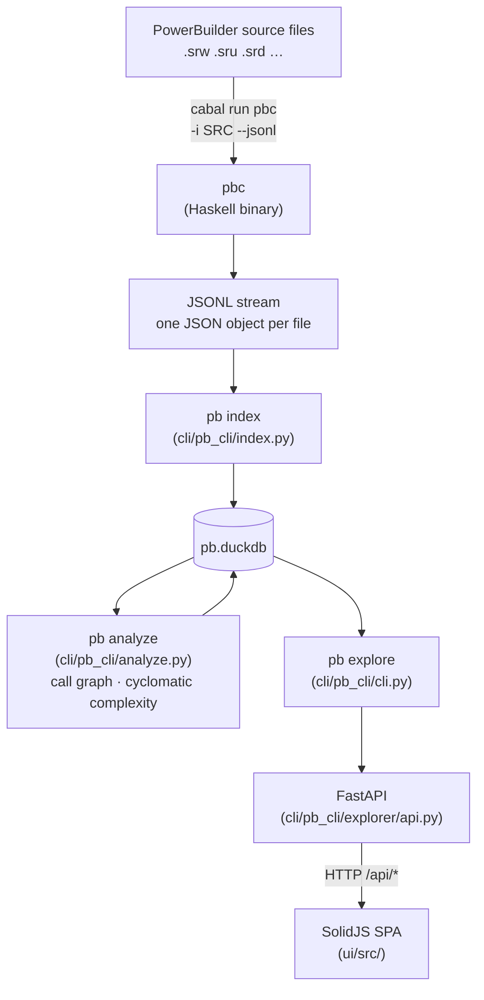
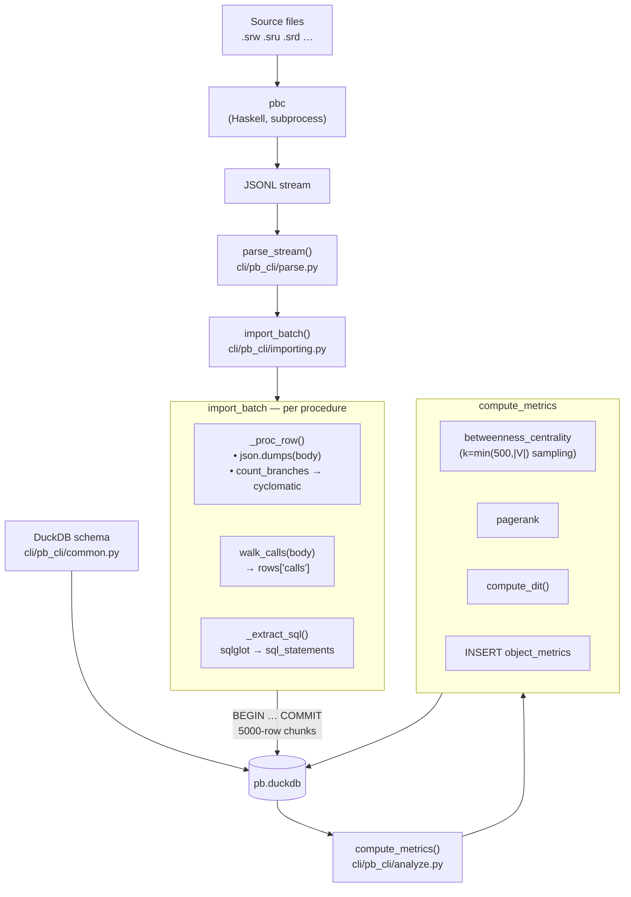
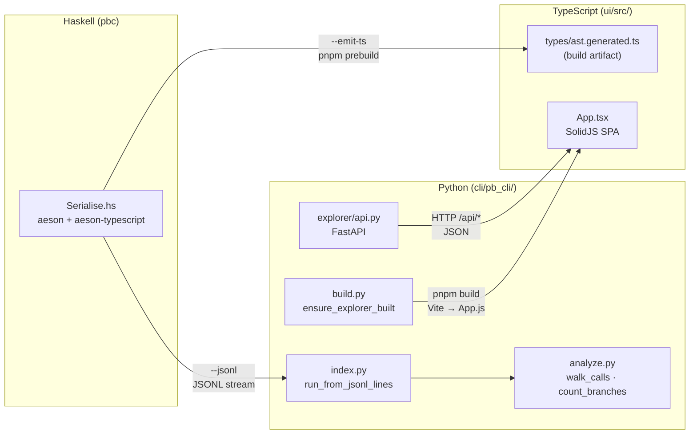

# Architecture

This repository contains three independent runtimes that form a pipeline:
**Haskell** parses PowerBuilder source files and runs all analysis passes,
**Python** drives orchestration and presents data via FastAPI, and
**TypeScript** renders the interactive web UI.

In DuckDB-direct mode (`pbc --db FILE`), Haskell writes all analysis
results (procedures, call resolution, taint, dead code) directly to DuckDB —
Python reads but never writes the analysis tables.  The older JSONL mode
(`pbc --jsonl | pb index`) still works for incremental re-runs via
`pb index`.

---

## Component map

```
pb/
├── compiler/                   Haskell parser (pb-compiler)
│   ├── src/                  Library (PB.* modules)
│   ├── app/                  pbc executable
│   ├── test/                 Test suite
│   └── pb-compiler.cabal          Cabal project configuration
├── cli/                      Python CLI tools
│   ├── pb_cli/               Python package (./pb or uv run --project cli pb_cli)
│   │   ├── cli.py            Entry point — all CLI sub-commands
│   │   ├── build.py          Build management: locate cabal binary, drive pnpm
│   │   ├── common.py         DuckDB schema (CREATE TABLE) + INSERT statements
│   │   ├── index.py          JSONL → DuckDB ingestion (pb index)
│   │   ├── analyze.py        Call graph metrics, cyclomatic complexity (pb analyze)
│   │   ├── diagram.py        GraphViz SVG generation (pb diagram)
│   │   ├── debt.py           BsRaw / ExRaw / DW coverage analyser (pb debt)
│   │   ├── queries.py        Auto-register queries/*.sql as `pb query` commands
│   │   ├── state.py          Incremental state tracking (file mtimes)
│   │   ├── pbl.py            .pbl extraction via powerbuilder-pbl-dump
│   │   └── explorer/         FastAPI backend (pb explore)
│   │       ├── api.py        FastAPI router — all /api/* endpoints
│   │       ├── app.py        App factory — mounts router + static files
│   │       ├── render.py     AST body_json → human-readable PBScript
│   │       └── static/       Served at /static/
│   │           ├── index.html  SPA shell page
│   │           ├── style.css
│   │           └── dist/     Vite build output (app.js) — not in git
│   ├── tests/                pytest test suite
│   ├── pyproject.toml        Python project configuration
│   └── uv.lock               Python dependency lockfile
├── ui/                       TypeScript / SolidJS SPA source
│   ├── src/
│   │   ├── App.tsx           SPA root component — wires store + routes
│   │   ├── core/             TCA-style framework primitives
│   │   │   ├── reducer.ts    Reducer<S,A,Env> type, pullback(), combine()
│   │   │   ├── effect.ts     Effect<A> class for async side effects
│   │   │   └── store.ts      createStore(), scope() — getState() on Store/ScopedStore
│   │   ├── app/              App-level wiring
│   │   │   ├── state.ts      AppState shape (single state tree)
│   │   │   ├── actions.ts    AppAction tagged union (routes to feature reducers)
│   │   │   ├── reducer.ts    combine() + pullback() for all feature reducers
│   │   │   └── api-client.ts Typed wrappers around /api/* endpoints
│   │   ├── features/         One sub-directory per feature slice
│   │   │   ├── navigation/   View routing, stats, detail panels
│   │   │   ├── objects/      Object list, search, sort, pagination
│   │   │   ├── diagrams/     SVG call-graph and lineage diagrams
│   │   │   ├── queries/      Custom SQL query runner
│   │   │   ├── search/       Full-text search
│   │   │   └── explore/      AST explorer (procedure body viewer)
│   │   ├── components/       SolidJS UI components (one file per panel)
│   │   └── types/
│   │       ├── api.ts              Hand-written API response shapes
│   │       └── ast.generated.ts    Generated from Haskell — not in git
│   ├── tests/                Vitest test suite
│   ├── package.json          pnpm project (SolidJS, Vite, Vitest)
│   ├── vite.config.ts        Builds src/App.tsx → ../cli/pb_cli/explorer/static/dist/
│   └── tsconfig.json
├── pb                        Top-level wrapper: uv run --project cli pb_cli $*
├── doc/                      Documentation and planning
│   ├── plan/                 Planning artifacts (BACKLOG, STRATEGY, session plans)
│   ├── spec.md               Parser specification
│   └── pbl-spec.txt          PBL file format spec
├── queries/                  SQL files served as `pb query <name>` commands
└── example/                  Corpus data (openpay-0.1.1b, PowerBuilder-Example)
```

---

## Data flow



The Python layer never reads source files directly.  In DuckDB-direct mode it
does not read analysis JSON at all — Haskell writes to DuckDB and Python reads
from there.  In JSONL mode Python consumes the JSON stream from `pbc`.

---

## Ingest pipeline internals

`pb index` drives a two-phase pipeline: **import** then **graph metrics**.
Understanding where time goes matters because the pipeline takes several minutes
on a mid-size codebase (~1051 files, 50 000 DB rows).

### Phase breakdown

| Phase | Typical time | Bottleneck |
|-------|-------------|-----------|
| Parsing (subprocess) | ~13 s | Haskell GC + file I/O |
| Indexing | ~3 m 40 s | JSON (de)serialisation, sqlglot SQL parsing, DuckDB writes |
| Graph metrics | ~3 m 30 s | NetworkX betweenness centrality — O(V²E) exact algorithm |
| **Total** | **~10 min** | |

### Indexing phase (`cli/pb_cli/index.py`)

`import_batch` accumulates all rows from the parsed object stream into Python
lists (one list per table), then flushes in chunks of 5 000 rows inside a
single explicit `BEGIN`/`COMMIT` transaction.

The following work happens **in-memory before any DB write** to avoid
re-reading the `procedures` table later:

- **Cyclomatic complexity** — `count_branches(body) + 1` is computed on the
  already-deserialized body dict in `_proc_row()` and stored directly in the
  `procedures.cyclomatic` column.
- **Call extraction** — `walk_calls(body)` runs on the same dict in
  `_import_ps()` and populates `rows['calls']` directly.

Both operations were previously a separate analyze sub-phase that re-fetched
every procedure from the DB and re-parsed `body_json` through `json.loads`.
Merging them into indexing eliminates ~2 m 10 s of redundant work.

SQL statements embedded in procedure bodies (`SELECT`, `INSERT`, etc.) are
identified by `_is_sql()` and parsed by `sqlglot` (with Oracle dialect) to
extract table/column references.  This is the remaining CPU cost inside
indexing.

### Graph metrics phase (`cli/pb_cli/analyze.py`)

`compute_metrics` rebuilds `object_metrics` from scratch on every run using
four NetworkX operations over the call graph:

1. **Betweenness centrality** — approximated by sampling `k = min(500, |V|)`
   pivot nodes (`nx.betweenness_centrality(G, k=k)`).  Exact computation is
   O(V²E) and dominates runtime for large graphs; sampling gives directionally
   correct values at a fraction of the cost.
2. **PageRank** — iterative power method (default 100 iterations, tol 1e-6).
3. **DIT** (depth of inheritance tree) — BFS from each root of the inheritance
   graph.
4. **Row assembly + insert** — one bulk `executemany` into `object_metrics`.

`object_metrics` and `calls` are treated differently:

- `object_metrics` is always fully rebuilt (DROP + CREATE + INSERT).
- `calls` is an incremental table in the permanent schema: rows for modified or
  deleted files are pruned by `delete_file_rows` before re-ingestion, so
  partial re-runs stay consistent.

### Data flow inside `pb index`



### Incremental re-runs

`pipeline.py` hashes every source file with SHA-256 and stores results in
`file_state`.  On re-run, only new or changed files are parsed and re-ingested.
`delete_file_rows` prunes all rows for the changed file across every table in
`TABLES` (including `calls`) before the new rows are inserted.  `object_metrics`
is always fully rebuilt from the current `calls` and `procedures` tables after
any indexing activity.

---

## Cross-component interfaces



### Haskell → TypeScript: `--emit-ts`

`pbc --emit-ts` uses `aeson-typescript` to derive TypeScript type
definitions directly from the Haskell AST types and prints them to stdout.
The `prebuild` npm script writes this output to
`src/types/ast.generated.ts` each time `pnpm build` is invoked:

```json
"prebuild": "cabal run --project-dir ../parser pbc -v0 -- --emit-ts > src/types/ast.generated.ts"
```

`ast.generated.ts` is a build artifact (not committed to git) that emits
`export type` / `export interface` declarations.  It is imported by
`ui/src/types/state.ts`, `actions.ts`, `core.ts`, `api-client.ts`, and
`components/Explore.tsx` to type the `BodyStmt[]` AST payloads flowing
through the explore API.

### Haskell → Python: JSONL

`pbc -i SRC_DIR --jsonl` prints one JSON object per file to stdout.
`cli/pb_cli/index.py:run_from_jsonl_lines` reads this stream and populates
DuckDB.  The JSON encoding follows `genericToJSON` conventions:

| Shape | Haskell | JSON |
|-------|---------|------|
| sum type, single-value constructor | `BsReturn (Maybe Expr)` | `{"tag":"BsReturn","contents": …}` |
| sum type, record constructor | `ExBinOp` with `lhs`, `op`, `rhs` | `{"tag":"ExBinOp","lhs":…,"op":…,"rhs":…}` |
| sum type, nullary constructor | `BsExit` | `{"tag":"BsExit"}` |
| product type (record) | `Lvalue {segments}` | `{"segments":[…]}` |

Tag strings are Haskell constructor names verbatim (`"BsIf"`, `"ExCall"`,
`"DwRetrieveOk"` — **not** short forms like `"if"` or `"ok"`).  Any Python
or TypeScript code that pattern-matches on these strings must use the full
constructor name.

### Python → TypeScript: static files

`cli/pb_cli/build.py:ensure_explorer_built` calls `pnpm build` (with
`--frozen-lockfile install` first if `node_modules` is absent).  `pnpm build`
runs `prebuild` (emits TypeScript types) then Vite, writing
`static/dist/App.js`.  The FastAPI app mounts `static/` at `/static/`.

Staleness is determined by comparing the mtime of `cli/pb_cli/explorer/static/dist/app.js`
against `ui/src/**/*.ts`, `ui/src/**/*.tsx`, `ui/package.json`, and `ui/vite.config.ts`.

### TypeScript → FastAPI: HTTP

`src/api-client.ts` issues typed `fetch` calls to `/api/*` endpoints.
`src/types/api.ts` hand-documents the response shapes.  There is no code
generation for the API contract — changes to `api.py` must be reflected in
`api.ts` manually.

---

## UI state architecture

The SPA uses a TCA 1.0–inspired architecture (`core/`) layered over
[Valtio](https://github.com/pmndrs/valtio) for reactive state and SolidJS
signals for rendering.

### Core abstractions

**`Reducer<S, A, Env>`** (`core/reducer.ts`)

A pure function `(draft: S, action: A, env: Env) => Effect<A> | null`.
Reducers mutate `draft` in place (Valtio proxy) and optionally return an
`Effect` describing async side work.  Two composition helpers:

- `pullback(child, get, match, widen, getEnv)` — scopes a child reducer to a
  slice of parent state and a subset of parent actions.
- `combine(...reducers)` — runs all reducers over the same draft and merges
  any returned effects.

**`Effect<A>`** (`core/effect.ts`)

An opaque wrapper around `(send: (a: A) => void) => Promise<void>`.  Effects
are returned from reducers; the store executes them after the synchronous
mutation is complete and dispatches the resulting actions back into the store.
Combinators: `Effect.fromPromise`, `Effect.send`, `Effect.merge`, `.map`,
`.catch`.

**`createStore`** (`core/store.ts`)

Creates a Valtio `proxy` and a `dispatch` function.  Each `dispatch` call
runs the top-level reducer synchronously (mutating the proxy), then executes
any returned `Effect` asynchronously.  `store.getState()` returns a SolidJS
reactive accessor for the current state snapshot (call inside a component);
`scope` narrows a parent store to a child state/action slice for prop-drilling.

### Feature slices

Each feature under `features/` is self-contained:

| File | Purpose |
|------|---------|
| `types.ts` | State shape for this feature |
| `actions.ts` | Tagged action union for this feature |
| `reducer.ts` | `*Reducer` + `*Env` interface (API dependencies) |

The `*Env` interface lists every external dependency (API calls, etc.) as
`Effect`-returning methods.  This keeps reducers pure and trivially testable —
tests inject a fake `Env` with `Effect.send`.

### Wiring

`app/reducer.ts` calls `combine(pullback(navReducer, …), pullback(objectsReducer, …), …)`
to produce the single top-level `AppState` / `AppAction` reducer.
`App.tsx` calls `createStore(initialState(), reducer, env)` once and passes
`dispatch` (and scoped stores) down the component tree.

---

## Key files by concern

| Concern | File(s) |
|---------|---------|
| Parsing PowerBuilder syntax | `compiler/src/PB/Lexing/`, `compiler/src/PB/Grammar/` |
| AST data types | `compiler/src/PB/AST/` |
| JSON serialisation + TS codegen | `compiler/src/PB/Pipeline/Serialise.hs` |
| DuckDB-direct I/O (passes 1–8) | `compiler/src/PB/Pipeline/DuckDb.hs` |
| CLI entry point (Haskell) | `compiler/app/Main.hs` |
| DuckDB schema (Python side) | `cli/pb_cli/common.py` |
| JSONL → DuckDB ingestion | `cli/pb_cli/index.py` |
| Call graph + cyclomatic complexity | `cli/pb_cli/analyze.py` |
| FastAPI endpoints | `cli/pb_cli/explorer/api.py` |
| AST → PBScript rendering | `cli/pb_cli/explorer/render.py` |
| Explorer build orchestration | `cli/pb_cli/build.py:ensure_explorer_built` |
| SPA root | `ui/src/App.tsx` |
| SPA state shape | `ui/src/app/state.ts`, `ui/src/features/*/types.ts` |
| SPA actions | `ui/src/app/actions.ts`, `ui/src/features/*/actions.ts` |
| SPA reducer + store | `ui/src/core/reducer.ts`, `ui/src/core/store.ts`, `ui/src/app/reducer.ts` |
| SPA async effects | `ui/src/core/effect.ts` |
| Generated AST types (TS) | `ui/src/types/ast.generated.ts` (build artifact; `pnpm prebuild` regenerates) |
| SQL query commands | `queries/*.sql` |

---

## Testing

| Layer | Command | Location |
|-------|---------|----------|
| Haskell | `cabal test` (in `compiler/`) | `compiler/test/` |
| Python | `uv run pytest` (in `cli/`) | `cli/tests/` |
| TypeScript | `pnpm test` (in `ui/`) | `ui/tests/` |
| Debt gate | `uv run --project cli pb_cli debt` | checks ExRaw, BsRaw, DW coverage |

Haskell tests include corpus oracle tests (`test/CorpusDebtTest.hs`,
`test/CorpusInvariantTest.hs`) that gate on zero corpus errors and ratcheted
ExRaw/BsRaw counts.

---

## Build sequence (fresh checkout)

```bash
# 1. Build and test Haskell
cd parser && cabal build && cabal test

# 2. Install Python deps
cd cli && uv sync

# 3. Run pb index to populate pb.duckdb
./pb index example/openpay-0.1.1b-extract

# 4. Start the explorer (auto-builds TS on first run)
./pb explore
```

---

## Common gotchas

**Tag names use Haskell constructor names.**  After the plan-36 serialise
rewrite (`6fa3e1a`), tag strings are full constructor names (`"BsIf"`,
`"ExCall"`, `"DwRetrieveOk"`).  Short forms (`"if"`, `"call_expr"`, `"ok"`)
no longer appear in any JSON output.  Python code that checks `node["tag"]`
must use the full name.

**`contents` wrapping.**  Single-value constructors always put their payload
under `"contents"`.  Record constructors put fields at the same level as
`"tag"`.  There is no way to tell from the tag name alone — consult
`compiler/src/PB/Pipeline/Serialise.hs` or `ui/src/types/ast.generated.ts`.

**`ast.generated.ts` is not in git.**  It is regenerated by `pnpm prebuild`
on every `pnpm build`.  If TypeScript compilation fails on a clean checkout,
run `pnpm run codegen` (or `pnpm build`) to create it.

**`pb.duckdb` is a local artefact.**  Tests must never reuse a root-level
`pb.duckdb`; each test fixture that needs a database should create a fresh
temp file.  The explorer test fixture (`test_explorer.py`) and index test
fixture (`test_index.py`) both do this.
