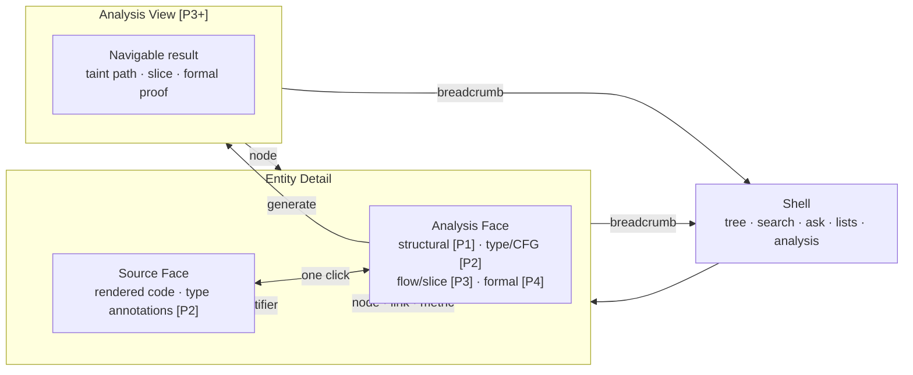
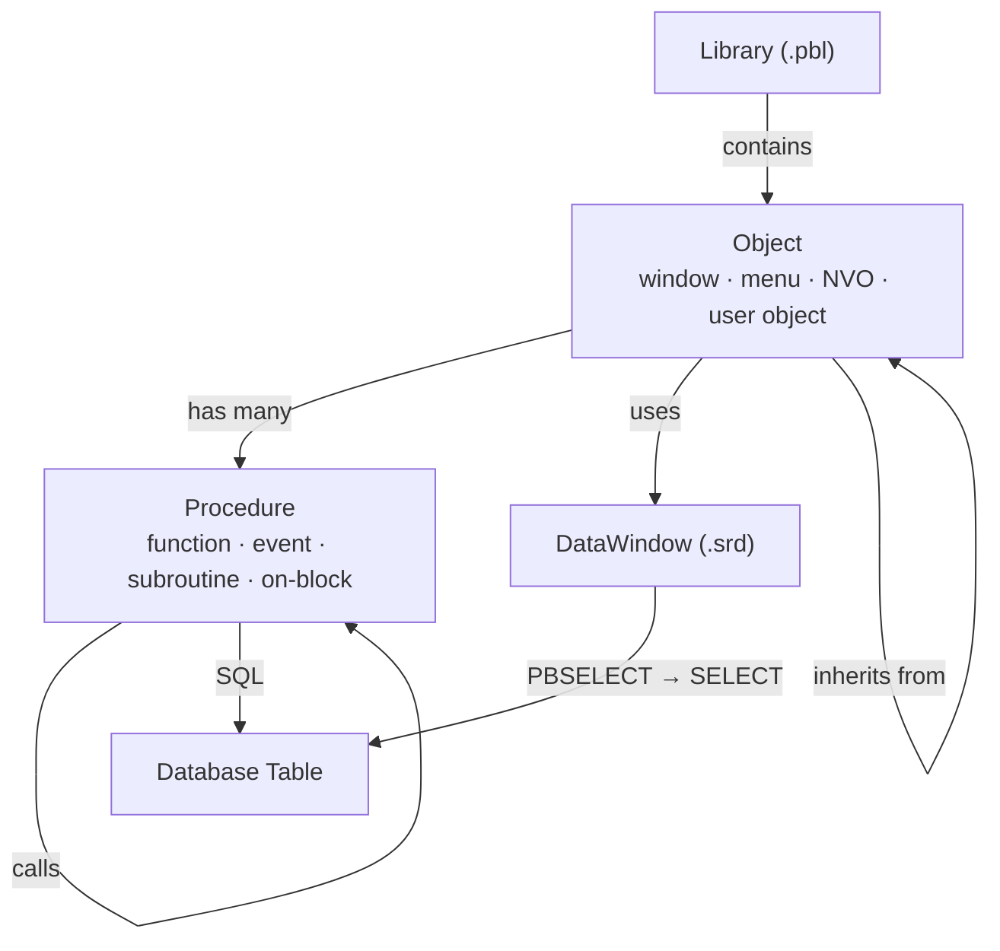
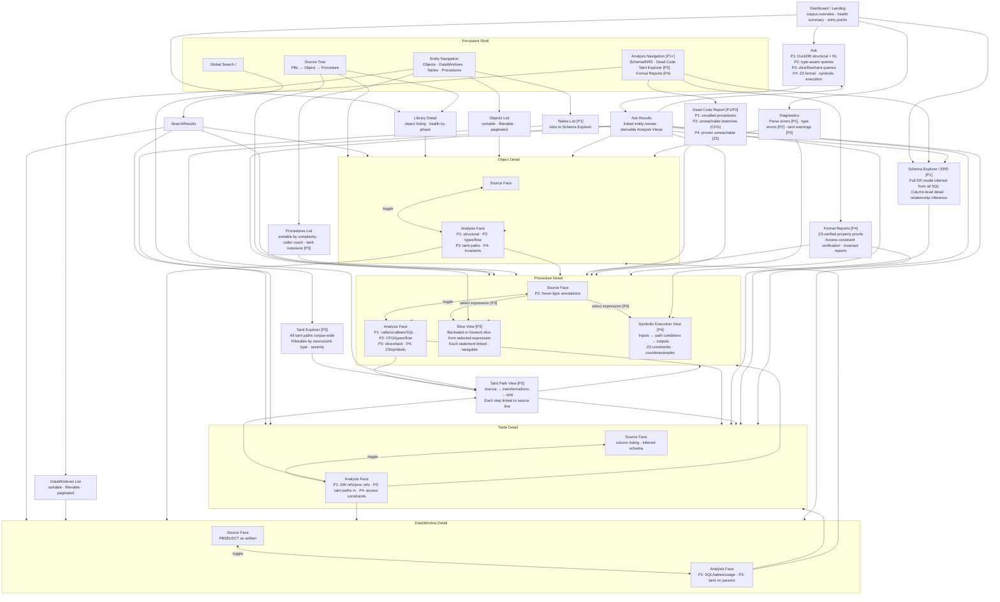
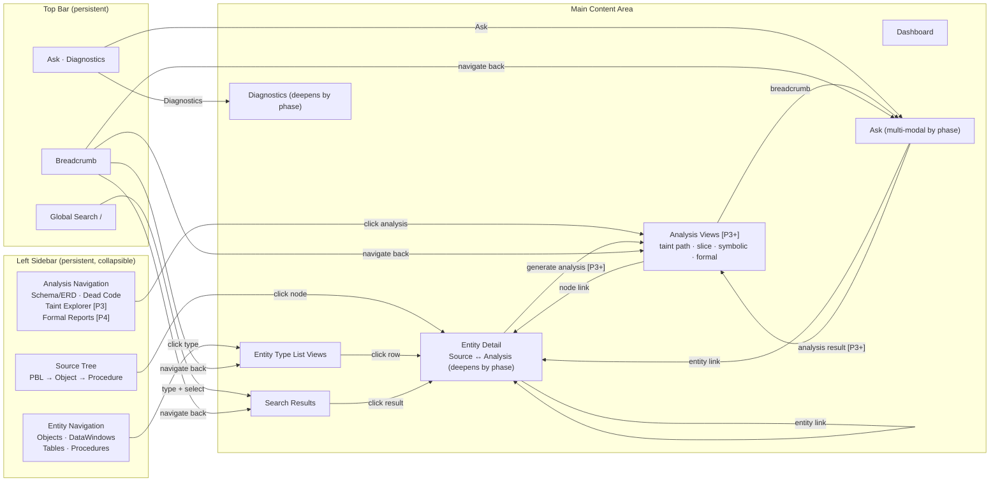
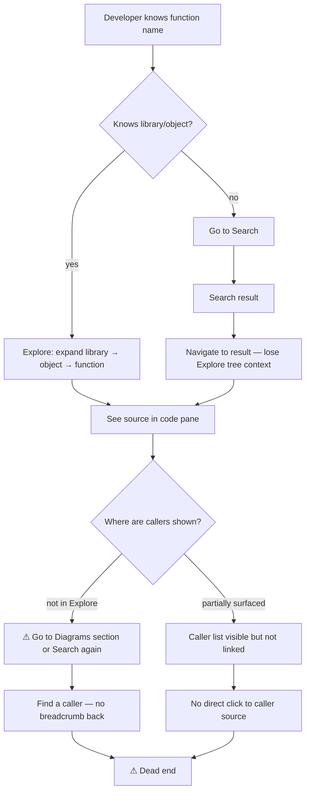
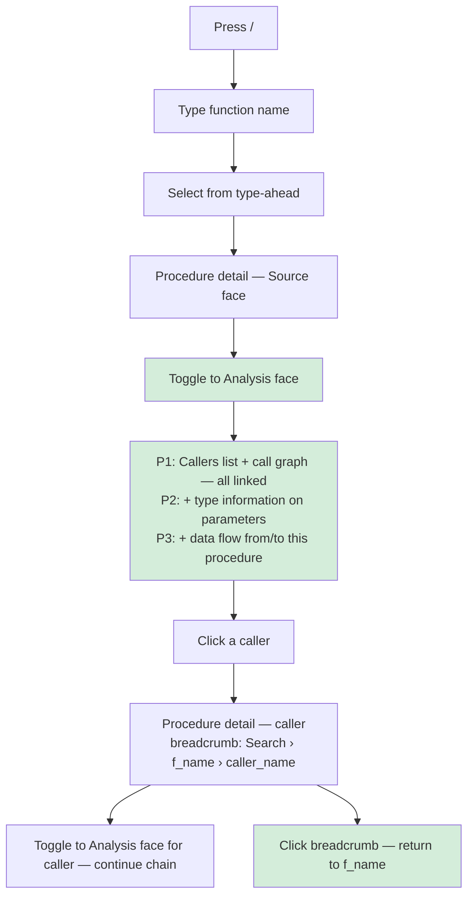
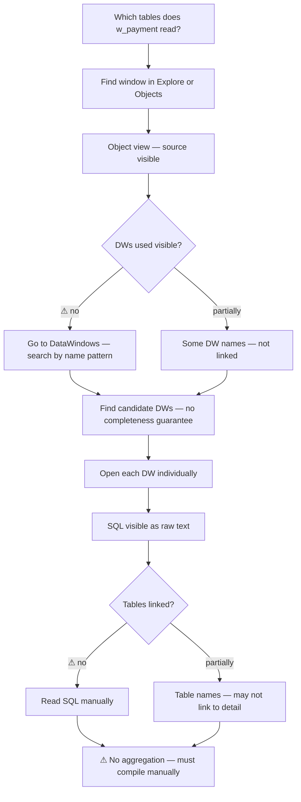
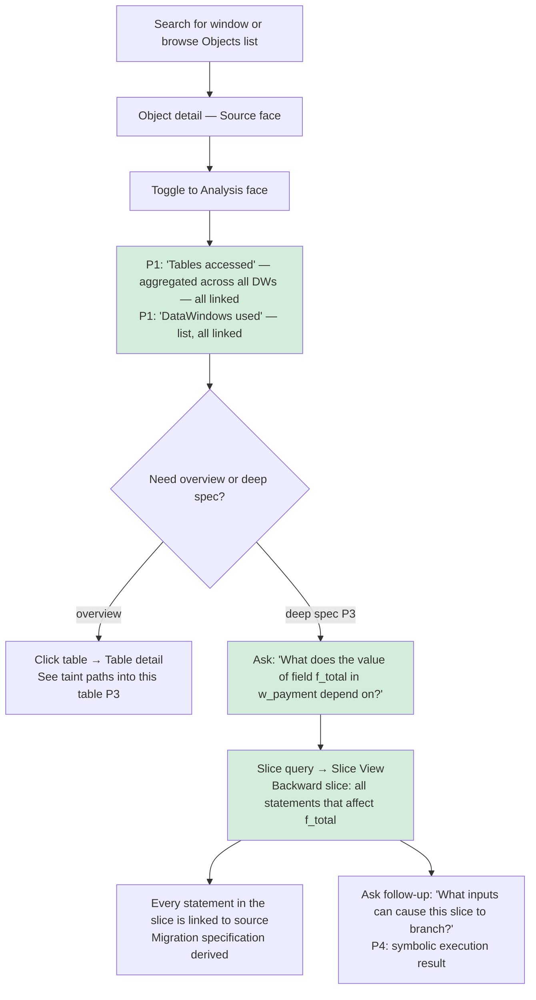
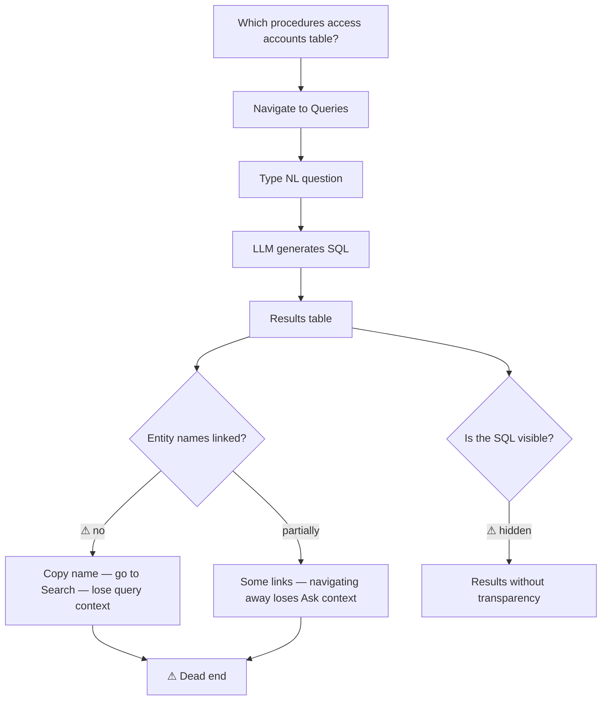
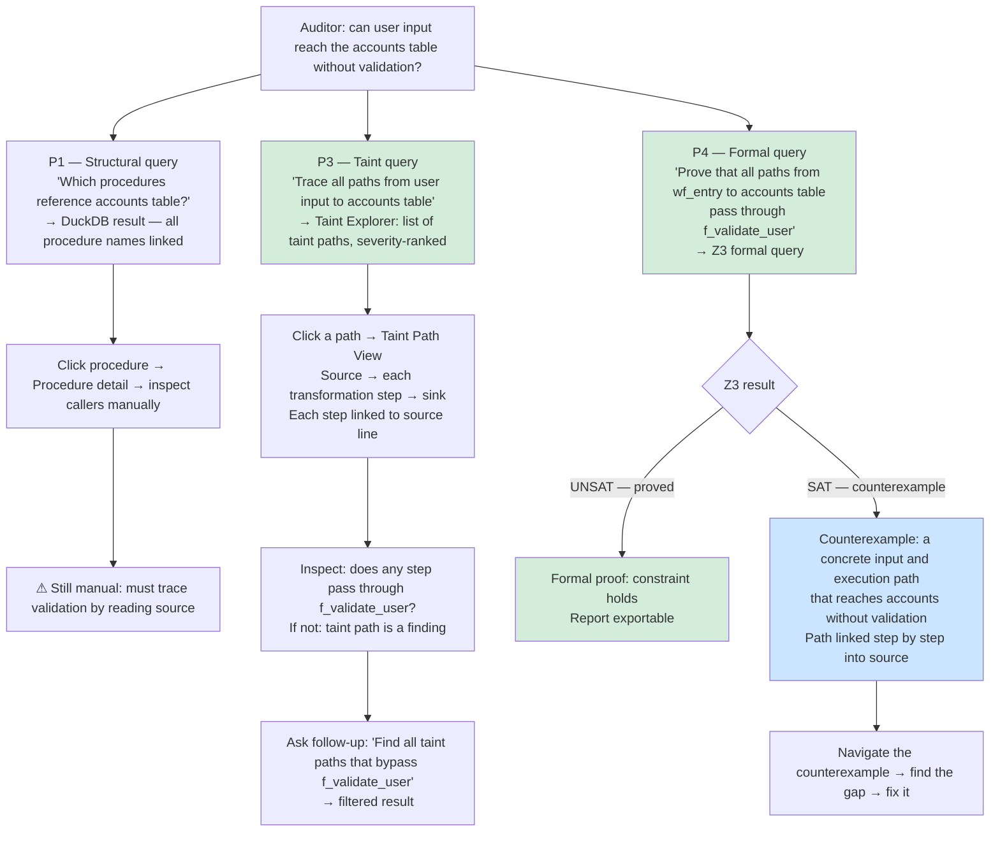

# pb — Information Architecture

> Part 1 of the pb design series. Every section that resolves a real design
> choice includes an "Alternatives considered" note. These notes prevent future
> sessions from re-debating settled decisions and prevent Plan 85 from
> reintroducing rejected approaches.
>
> Series: **1 — Information Architecture** · [2a — Journey Maps](2a-journey-maps.md) · [2b — Interaction Design](2b-interaction-design.md) · [2c — Component Specs](2c-component-specs.md) · [3 — UI Direction](3-ui-direction.md)

---

## Phase model

Analysis capabilities are built incrementally. Each capability below is
annotated with the phase in which it becomes available. The IA is defined
across all phases — the design does not change when a phase lands; new surfaces
become visible and existing surfaces gain depth.

| Phase | Label | Prerequisite | Contents |
|---|---|---|---|
| 1 | **P1** | Current state | Structural analysis: call graphs, inheritance, DW dependencies, complexity metrics, ERD inference from SQL, structural dead code |
| 2 | **P2** | Typing pass | Type information on all expressions; CFG per procedure; intra-procedural data flow; type-level queries; type safety diagnostics |
| 3 | **P3** | Analysis infrastructure | Inter-procedural data flow; program slicing; context-insensitive taint analysis; narrow symbolic execution |
| 4 | **P4** | Formal reasoning | Context-sensitive taint; Z3-backed property verification; symbolic execution at scale; formal specification export |

**On `Any`.** PowerBuilder supports an `Any` type that accepts any value at
runtime. It is relatively rare in practice but present in the corpus. The
typing pass assigns `Any` at the top of the type lattice: expressions of type
`Any` are treated conservatively in all static analyses — they cannot be ruled
out as taint sources, cannot participate in type-level narrowing, and require
widening in Z3 constraint generation. The design accommodates this without
special-casing it in the UI.

**On the LLM's role in P3/P4.** The Ask surface does not change structurally
across phases. The LLM always translates a natural language question into the
appropriate formal query. In P1/P2 that query is SQL over the structural
database. In P3 it may be a data flow query or slice query. In P4 it may be a
Z3 proposition, a taint query with formal guarantees, or a symbolic execution
request. The user's question looks the same; the back-end deepens.

---

## 1. Design Principles

### 1.1 Core Principle: Fluent Traversal

pb is built around a single invariant: **following a chain of questions must
never require a mode switch, a context reset, or a dead end.** When a developer
is tracing a bug, a modernization team is specifying what a window does, or an
auditor is formally verifying a data access constraint, each answer raises the
next question. The tool must make each step instantaneous and frictionless — the
work of understanding is thinking, not navigating software.

Every design decision in this document is evaluated against this invariant. A
proposed design that creates a dead end, loses breadcrumb context, or forces a
user out of their navigation chain violates the core principle and must be
revised.

### 1.2 Analysis is a First-Class Pillar

pb is a **static analysis platform** whose navigation layer feels like a code
browser. The call graph, inheritance diagram, and ERD are not the product —
they are the rudimentary structural foundations. The product is what the
complete compiler front-end enables: control flow, data flow, program slices,
taint paths, and formally verified properties over the entire codebase.

This shapes the entity model: every entity has an analysis face that deepens
across phases, not a fixed set of diagrams. It shapes Ask: the LLM front-end
translates questions into whichever formal system can answer them. It shapes
the navigation model: cross-entity analysis results (taint paths, slices) are
first-class navigable surfaces with their own breadcrumb support.

The IA is not defined by what is built today. It is defined by the full
capability of the front-end and progressively populated as infrastructure lands.

### 1.3 Traversal Model

**Implications:**

- Browse and Understand are two faces of every entity — toggling between source
  and analysis is a toggle on the detail screen, not a navigation event.
- Every entity name anywhere in the app is a link into entity detail.
- Analysis Views are a distinct screen type generated by formal analysis queries
  (taint, slice, Z3). Each node in an Analysis View links into the relevant
  entity detail at the relevant source line. Analysis Views have breadcrumb
  support and can be saved as named queries.
- The breadcrumb always preserves the navigation chain, whether the chain
  passes through entity details, list views, Ask results, or Analysis Views.

### 1.4 Entity Model

**Source and analysis faces per entity type:**

| Entity | Source Face | Analysis Face |
|---|---|---|
| **Library** | Object listing (name, type, LOC); file path | **P1:** Complexity distribution; object type breakdown; inter-library dependency summary; uncalled procedure count **P2:** Type error count **P3:** Taint source/sink summary for this library |
| **Object** | Rendered PowerScript; variable declarations; procedure/event index | **P1:** Inheritance diagram; call graph; DataWindows used; callers; complexity metrics **P2:** Type information; intra-procedural data flow summary **P3:** Taint paths that pass through this object; slice entry points **P4:** Z3-verified object invariants |
| **Procedure** | Rendered PowerScript with syntax highlighting; parameter and return types; containing object context **[P2: hover-type annotations on all expressions]** | **P1:** Callers; callees; call graph; SQL statements; cyclomatic complexity **P2:** CFG diagram; type information; intra-procedural data flow; unreachable branches (structural) **P3:** Backward/forward slice from any expression; inter-procedural data flow; taint paths through this procedure; dead branches (proven) **P4:** Z3-verified preconditions and postconditions; symbolic execution results; formal property proofs |
| **DataWindow** | Rendered DW definition with PBSELECT shown as written (IDE parity); control inventory | **P1:** Parsed SELECT retrieve definition; tables accessed with links; compute expressions; WHERE clause parameters; usage — which objects and procedures reference this DW **P2:** Column types; parameterized query analysis **P3:** Taint analysis on SQL parameters — which columns receive user-controlled values; injection risk flags **P4:** Formal SQL safety properties |
| **Table** | Table name; column list and types (when schema available); inferred from DW SQL | **P1:** DataWindows that read this table; procedures that reference it in SQL; read/write access pattern **P3:** Taint paths that reach this table — which sources flow to this table, and through which procedures **P4:** Formally verified access constraints |

**Note on PBSELECT vs SELECT.** PBSELECT is a mechanical encoding artifact —
the PB IDE stores the retrieve SQL in a PBSELECT dialect rather than standard
SQL, but it is semantically a SELECT. The source face preserves PBSELECT as
written (IDE parity). The analysis face treats it as a plain SELECT: same table
references, same join relationships, same dependency links, same taint analysis
surface.

**Alternatives considered:**

*Flattening Object and Procedure into one entity type:* Object and Procedure
have fundamentally different analysis surfaces. An Object has an inheritance
chain, a set of DataWindows, and callers from other objects. A Procedure has a
CFG, intra/inter-procedural data flow, slices, and taint paths. Merging them
would force incompatible analysis faces onto the same screen. Rejected.

*Making Analysis Views persistent entity types:* Taint paths and slices are
generated, not stored. Making them first-class entities would require a
persistence model that adds complexity with little benefit — they are more
naturally treated as named query results. Rejected.

*Separating the analysis depth levels into separate "modes":* Splitting P1/P2/P3
into distinct app modes (e.g., "basic" vs. "advanced" view) would require users
to opt into analysis depth and would create the mode-switching anti-pattern the
traversal invariant prohibits. Instead, deeper analysis surfaces appear
progressively on the same analysis face as infrastructure lands. Rejected.

---

## 2. Site Map

Phase labels mark which phase a screen or capability becomes available.

**Screen inventory:**

| Screen | Phase | Purpose |
|---|---|---|
| Dashboard / Landing | P1+ | Corpus overview; phased health summary; entry point tiles |
| Source Tree (sidebar) | P1 | Hierarchical browse: PBL → Object → Procedure; always visible |
| Objects List | P1 | All objects, sortable/filterable; links to detail |
| DataWindows List | P1 | All DataWindows, sortable/filterable; links to detail |
| Tables List | P1 | All tables; links to detail and Schema Explorer |
| Procedures List | P1 | All procedures; sortable by complexity, caller count; P3: taint exposure |
| Global Search Results | P1 | Type-ahead + full results; links into any entity detail |
| Library Detail | P1 | Object listing; complexity distribution; P2+ health metrics |
| Object Detail (source) | P1 | Rendered PowerScript; variable declarations; procedure index |
| Object Detail (analysis) | P1+ | Structural → type/flow → taint paths → invariants across phases |
| Procedure Detail (source) | P1 | Rendered PowerScript; P2: hover-type annotations on expressions |
| Procedure Detail (analysis) | P1+ | Callers/callees → CFG/types → slices/taint → Z3/symbolic across phases |
| DataWindow Detail (source) | P1 | DW definition; control inventory; PBSELECT as written |
| DataWindow Detail (analysis) | P1+ | SQL/tables/usage → parameterized query analysis → taint on params |
| Table Detail (source) | P1 | Column listing; inferred or live schema |
| Table Detail (analysis) | P1+ | DW refs/proc refs → taint paths in → formal access constraints |
| Schema Explorer / ERD | P1 | Full ER model inferred from all DataWindow SQL across corpus |
| Dead Code Report | P1/P2/P4 | Uncalled procedures (P1); unreachable branches (P2); Z3-proven (P4) |
| Taint Explorer | P3 | All corpus-wide taint paths; filterable by source/sink/severity |
| Taint Path View | P3 | Single taint path: source → transformations → sink; each step linked |
| Slice View | P3 | Backward or forward program slice from a selected expression |
| Symbolic Execution View | P4 | Inputs, path conditions, outputs, Z3 constraints, counterexamples |
| Formal Reports | P4 | Z3-verified proofs; access constraint verification; invariant reports |
| Ask | P1+ | Multi-modal query: DuckDB (P1) → type queries (P2) → flow/slice/taint (P3) → Z3/symbolic (P4) |
| Ask Results | P1+ | Tabular results with linked entity names; derivable Analysis Views |
| Diagnostics | P1+ | Parse errors (P1); type errors (P2); taint warnings (P3) |

---

## 3. Navigation Model

### 3.1 Hard Question: Shell Structure

**Question:** How do the source tree, global search, and analysis surfaces
relate in the outer shell?

**Resolution: Persistent sidebar tree + entity-type navigation + analysis
navigation + top bar search.**

The shell has four structural components:

1. **Left sidebar — source tree** (collapsible). Libraries → objects →
   procedures. The PB developer's home. Familiar IDE spatial layout.

2. **Left sidebar — entity navigation.** Objects, DataWindows, Tables,
   Procedures as direct links to list views. Serves modernization teams
   browsing by type rather than hierarchy.

3. **Left sidebar — analysis navigation** (phase-gated). Schema/ERD, Dead
   Code, Taint Explorer, Formal Reports. Corpus-level analysis views that
   don't belong to any entity type. New items appear here as phases land.

4. **Top bar.** Global search (`/`), breadcrumb, Ask link, Diagnostics link.
   Always accessible regardless of location.

**Alternatives considered:**

*Merging entity navigation and analysis navigation into one nav group:* Entity
types (Objects, DataWindows) and corpus-level analysis views (Taint Explorer,
Dead Code) serve different browsing modes. Merging them creates a nav group
that grows unboundedly as new analyses are added and mixes structural browsing
with formal analysis. Separate groups are cleaner and phase-gate naturally.
Rejected.

*Tab-based shell:* Tabs imply mutually exclusive modes. The vision requires
Browse and Understand to be two faces of every entity, not two destinations.
Rejected (same as previous session).

*Overlay tree:* Hides the spatial orientation the PB developer depends on.
Rejected (same as previous session).

### 3.2 Hard Question: Browsing Without a Target

**Resolution:** Same as previous session — dedicated entity-type list views
with sort/filter controls, accessible from the entity navigation group.

**Addition:** The analysis navigation group extends this for analysis-level
browsing: "show me all taint paths in the corpus" or "show me all dead
procedures" are navigation targets, not search queries.

### 3.3 Hard Question: Landing Screen

**Resolution:** Dashboard with corpus overview and phased health summary.

The Dashboard adds to the previous design: as phases land, new health metrics
appear — type error count (P2), taint path count (P3), formal property
verification status (P4). The dashboard is not a static "corpus size" view; it
is a live summary of the analysis depth currently available and what it reveals.

### 3.4 New Hard Question: Where Do Analysis Views Live?

**Question:** A taint path, a program slice, a symbolic execution result — these
are generated, cross-entity, and don't belong to any single entity's detail
page. How do they fit the navigation model?

**Resolution: Analysis Views are a distinct screen type with full breadcrumb
support.**

An Analysis View is generated by: a formal query in Ask, a "generate slice"
action from a procedure's source view, a node click in Taint Explorer, or a
Z3 query result. It has:

- Its own URL/state (saveable as a named query result)
- Breadcrumb back to the surface that generated it
- Every node in the view is a link into entity detail
- A link back to the generating Ask query for refinement

The breadcrumb for an Analysis View reads:

- `Ask › query-name › Taint Path` (generated from Ask)
- `Object › Procedure › Slice from line 47` (generated from procedure source view)

**Alternatives considered:**

*Making Analysis Views persistent entities:* Taint paths and slices are
generated, not stored. Persisting them as entities would require a storage
model that adds complexity for little benefit. Named query results (saved Ask
queries whose results are re-runnable) cover the persistence use case. Rejected.

*Displaying Analysis Views inside the entity detail panel:* A taint path spans
many entities and doesn't belong to any one. Trying to display it inside, say,
the Procedure detail would truncate the cross-entity view. Analysis Views need
their own full-width surface. Rejected.

### 3.5 Navigation Model Diagram

---

## 4. User Flows

Each flow is traced twice: first through the current app (friction analysis),
then through the new design. The friction points become the explicit
requirements the new design must satisfy.

---

### 4.1 PB Developer: Tracing Callers of a Function

**Friction analysis — current app:**

**Friction points:** Callers not on the source view; mode switch required to
Diagrams; following a caller link loses tree context; no breadcrumb through the
chain.

**New design:**

**P3 extension:** Developer can also ask Ask: "What procedures call `f_process_payment` with a parameter derived from user input?" — a data flow query that filters callers by the provenance of their arguments. The result is an Ask Result table linking into each caller's procedure detail.

---

### 4.2 Modernization Team: "What Tables Does This Window Read?" and "What Is This Window's Full Specification?"

**Friction analysis — current app:**

**New design — P1 (tables) and P3 (full specification):**

**Requirements satisfied:**

- P1: Aggregated tables view answers the structural question in one toggle.
- P3: Slice extraction from Ask answers the behavioral specification question.
- P3: Migration team can ask "what can I safely not port?" → Dead Code Report shows uncalled procedures in this object's call graph.

---

### 4.3 Auditor: Formally Verifying a Data Access Constraint

**Friction analysis — current app:**

**New design — P1 through P4, showing the progression:**

**Requirements satisfied:**

- P1: Structural results are linked — no dead ends, query context preserved in breadcrumb.
- P3: Taint analysis answers the question automatically, without manual tracing through source.
- P4: Formal verification produces a proof or a counterexample with a concrete execution path. The auditor can follow the counterexample directly into source.
- Every phase is a complete, useful answer to the question — P4 is not required for the tool to be useful to auditors.
