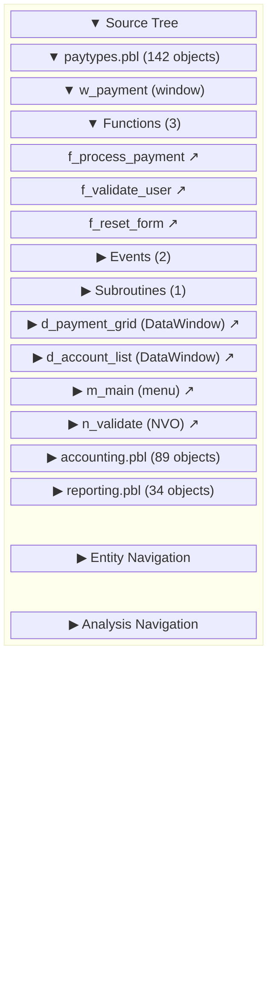
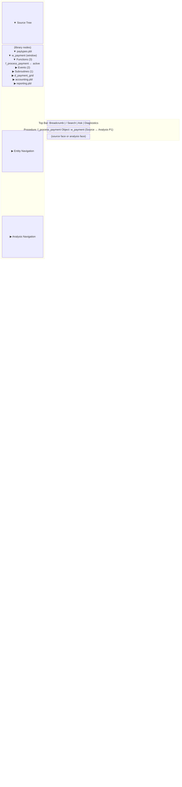
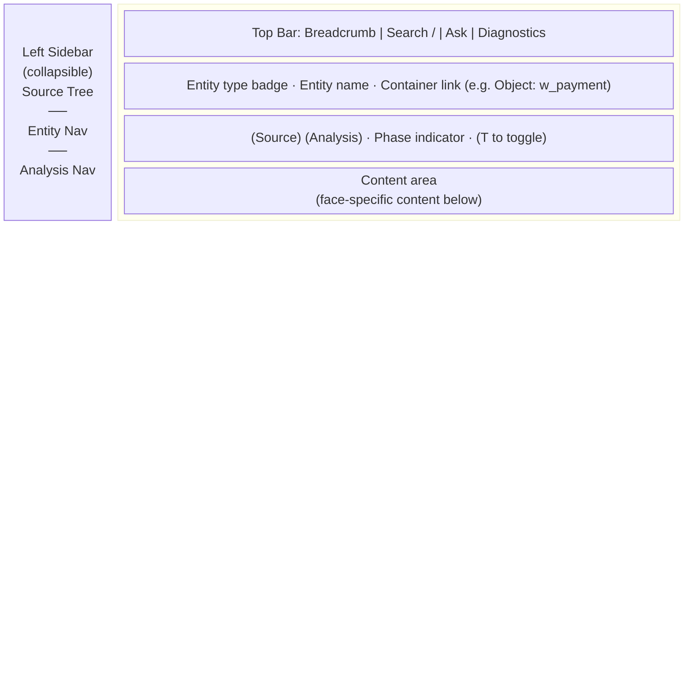
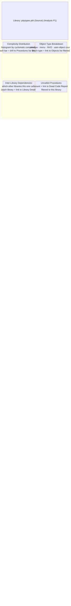
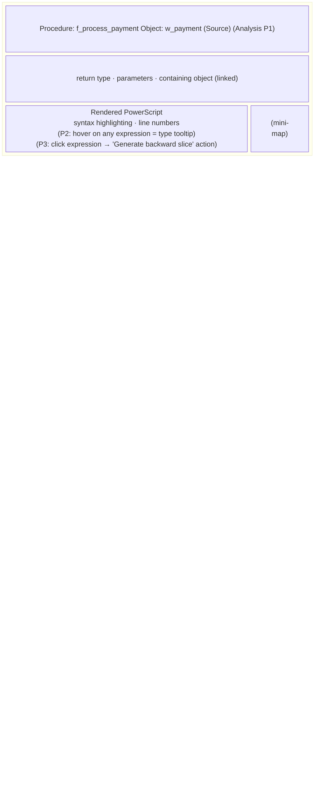
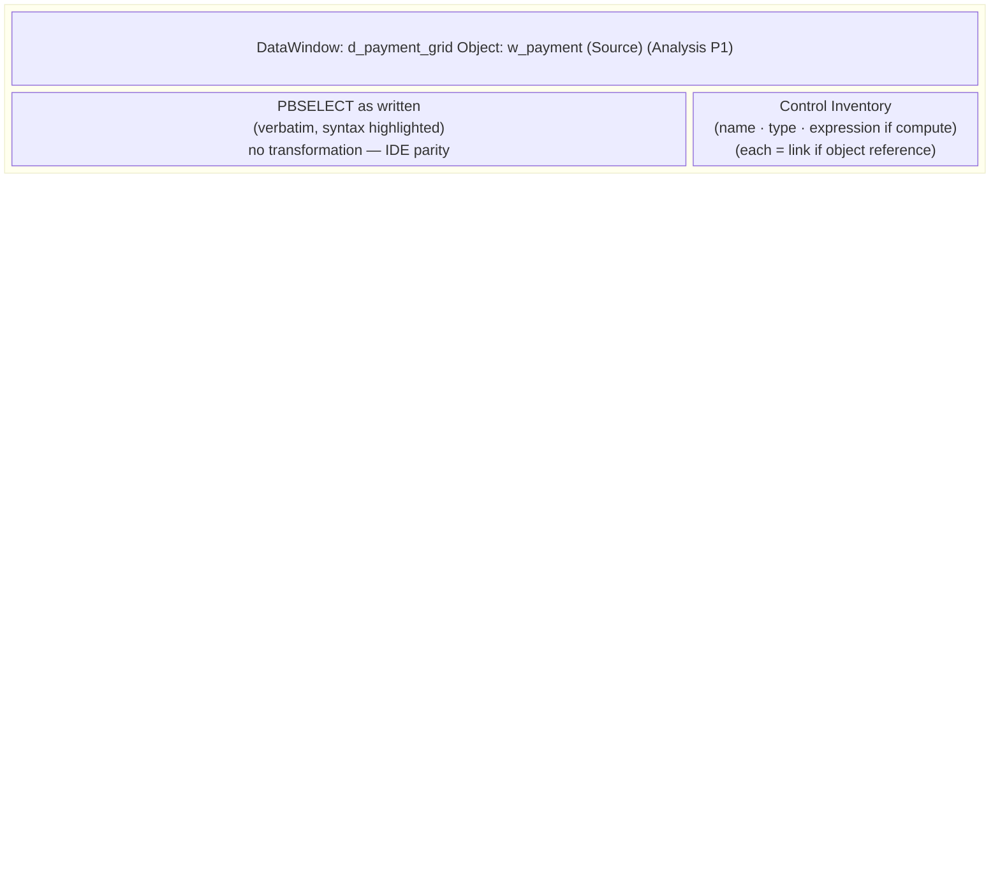
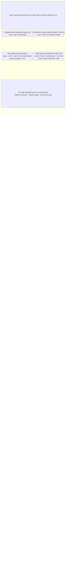

# pb — User Experience: Interaction Design

> Part 2b of the pb design series. This document resolves the six UX
> decisions, including wireframes and rejected alternatives, that define the
> behavioural layer of pb.
>
> Series: [1 — Information Architecture](1-information-architecture.md) ·
> [2a — Journey Maps](2a-journey-maps.md) · **2b — Interaction Design** ·
> [2c — Component Specs](2c-component-specs.md) · [3 — UI Direction](3-ui-direction.md)

---

## 1. Source Tree and Sidebar

### 1.1 Decision: Sidebar Structure and Default State

The sidebar has three groups: Source Tree, Entity Navigation, and Analysis
Navigation. Their layout and default state are the first thing every persona
encounters.

---

**Alternative A — All three groups expanded by default**

Every group is open on first load: Source Tree showing all libraries; Entity
Navigation showing all entity-type links; Analysis Navigation showing all
analysis items with phase badges.

*Problem:* A corpus with 10+ libraries fills the Source Tree immediately.
The Entity Navigation and Analysis Navigation items that are relevant to the
modernization team and auditor personas are pushed below the fold. Visual
noise on first load slows orientation for all three personas.

*Rejected for:* too much content on first load; Analysis Navigation items
compete with Source Tree before the user has oriented.

---

**Alternative B — Tabs: one sidebar group at a time**

Three tab icons on the sidebar edge. Clicking a tab switches the entire
sidebar between Source Tree, Entity Navigation, and Analysis Navigation.

*Problem:* This is a mode switch inside the sidebar. The PB developer who
wants the tree visible while also glancing at entity-type counts cannot have
both. The mode-switch anti-pattern the traversal invariant prohibits appears
inside the sidebar.

*Rejected for:* creates a mode switch; prevents two groups from being visible
simultaneously; contradicts the core design principle.

---

**Alternative C — Source Tree only; Entity Nav and Analysis Nav in the top bar**

The sidebar shows only the Source Tree. The entity-type list views and
analysis navigation are accessed via links in the top bar or the Dashboard.

*Problem:* The modernization team uses Entity Navigation constantly — "show
me all DataWindows," "all procedures sorted by complexity" — and needs those
links immediately accessible without opening the Dashboard first. Moving them
out of the sidebar creates extra navigation steps for their primary workflow.

*Rejected for:* extra steps to entity-type list views; Entity Navigation
belongs in persistent sidebar, not top bar.

---

**Alternative D — Three collapsible accordion groups (chosen)**

The sidebar has three vertically stacked accordion groups. Each can be
independently expanded or collapsed. Default state:

- **Source Tree**: expanded, libraries shown at top level (collapsed)
- **Entity Navigation**: collapsed
- **Analysis Navigation**: collapsed

*Chosen because:* Source Tree is visible immediately for the PB developer
persona; Entity Navigation and Analysis Navigation are accessible in one
click; no mode switches; each group can be open simultaneously if the user
wants both tree context and entity-type links visible.

---

### 1.2 Source Tree Wireframe

The Source Tree mirrors the PB IDE's object hierarchy. Sub-elements of an
Object are grouped by kind, not presented as a flat list. This is the single
most important spatial anchor for the PB developer persona.



---

### 1.3 Tree Node Taxonomy

Each node in the Source Tree has a type and a behaviour:

| Node type | Icon | Click action | Expand/collapse |
|---|---|---|---|
| Library (`.pbl`) | 📦 | Open Library Detail | Expands to show Objects |
| Object | 🪟 / 📋 / ☰ / 🔧 | Open Object Detail (source face) | Expands to show sub-element groups |
| Sub-element group (Functions / Events / Subroutines) | — | Expand/collapse only; no navigation | Yes |
| Individual procedure (function / event / subroutine) | ⚙ | Open Procedure Detail (source face) | No (leaf node) |
| DataWindow (`.srd`) | 📋 | Open DW Detail (source face) | No (leaf node) |

Object type icons:
- Window: 🪟
- Menu: ☰
- NVO / user object: 🔧
- DataWindow: 📋

Sub-element groups show a count in parentheses. A group with 0 members is
hidden (not shown as an empty group).

---

### 1.4 Sub-Element Grouping

The PB IDE presents sub-elements of an Object grouped by kind. pb matches
this exactly:

```
▼ w_payment  [window]
  ▼ Functions (N)
      f_process_payment
      f_validate_user
      …
  ▶ Events (N)
  ▶ Subroutines (N)
```

**Why group by kind rather than showing a flat list?**

A flat list of all procedures under an object loses the distinction between
functions (callable, have signatures and return types) and events (lifecycle
hooks, triggered by the runtime or user action). For a PB developer looking
for a bug in an event handler, scanning a flat list of functions first is
noise. The grouping matches the developer's mental model and the IDE they
already know.

**Alternatives considered:**

*Show only a flat "Procedures" list:* Simpler to implement, but loses the
Function / Event / Subroutine distinction the PB developer navigates by.
Rejected.

*Show Instance Variables and Structures as additional groups:* The IA entity
model does not treat instance variables as navigable entities — they appear
in the source face, not as navigation targets. Adding them to the tree
creates noise without navigation value. Deferred; revisit at Plan 85.

---

### 1.5 Tree Persistence and Auto-Reveal

**Persistence:** The tree expansion state is stored in the reducer per
session. Navigating from a procedure to a caller and back leaves the tree
exactly as the user left it — the same libraries open, the same object
expanded, the same sub-element group open.

**Auto-reveal:** When the user arrives at an entity via a route other than
the tree (global search, breadcrumb navigation, Ask result), the tree
auto-expands to reveal that entity's location in the hierarchy. The relevant
library opens, the object expands, and the active procedure is highlighted.
This ensures the tree always shows "you are here" — not just "what you last
clicked."

Auto-reveal does not collapse nodes the user has already opened. It only
adds the minimum expansion needed to reveal the current entity.

**Auto-reveal alternatives considered:**

*Never auto-reveal — tree only reflects manual navigation:* The user arrives
at a procedure via search and the tree shows a completely unrelated state.
This breaks the spatial anchor the PB developer persona relies on. Rejected.

*Full tree reset on auto-reveal — collapse everything except the current
path:* Too aggressive. The developer may have expanded three libraries to
compare structures; a reset destroys that context. Rejected.

---

### 1.6 Sidebar Full Layout Wireframe



**Entity Navigation (when expanded):**
```
▼ Entity Navigation
  Objects          →  (opens Objects List)
  DataWindows      →  (opens DataWindows List)
  Tables           →  (opens Tables List)
  Procedures       →  (opens Procedures List)
```

**Analysis Navigation (when expanded):**
```
▼ Analysis Navigation
  Schema / ERD       [P1]
  Dead Code          [P1]
  Taint Explorer     [P3 ▸]   ← phase-gated (muted style)
  Formal Reports     [P4 ▸]   ← phase-gated (muted style)
```

Phase-gated items use a muted text style and show a `▸` indicator. They
are visible but distinguished from available items. Clicking one navigates
to the PhaseGate capability-preview screen.

---

### 1.7 Sidebar State Variants

- *Collapsed sidebar:* A narrow rail shows only the group icons (`🌲` / `☰`
  / `🔍`). Clicking a group icon expands the sidebar to that group. A
  collapse button returns to the rail.
- *No corpus indexed:* Source Tree shows "No libraries indexed — run
  `pb index` to begin."
- *Index in progress:* Source Tree shows a progress indicator: "Indexing…
  412 / 777 files."
- *Large corpus (100+ libraries):* Libraries listed with a virtual scroll;
  search-within-tree input appears at the top of the Source Tree group.

---

## 2. Entity Detail Layout

### 2.1 Decision: Source/Analysis Face Toggle

**The constraint (from the IA):** Source and analysis are one click apart.
Toggling between them must not lose scroll position or selection state. The
pattern must work for all five entity types.

---

**Alternative A — Horizontal tab strip (Source | Analysis)**

```
┌─────────────────────────────────────────────────────────────┐
│ Procedure: f_process_payment       [Object: w_payment]      │
├─────────────────────────────────────────────────────────────┤
│  [Source]  [Analysis]                                       │
├─────────────────────────────────────────────────────────────┤
│  (content for active tab)                                   │
```

Tabs are familiar, clearly labelled, explicitly stateful. However: tab
semantics imply that the two faces are equal in weight and stable in
structure. The Analysis face grows across phases — P1 shows callers; P2 adds
CFG; P3 adds taint paths; P4 adds formal proofs. On a tab, this growth is
invisible from the outside. The user has no indication that the Analysis tab
has more content than last time they visited.

*Rejected for:* growth invisibility; no natural affordance for indicating new
analysis depth; the "analysis" label becomes a catch-all kitchen sink that
grows without telling the user.

---

**Alternative B — Split panels (Source left | Analysis right)**

```
┌────────────────────────┬────────────────────────────────────┐
│  Source (50%)          │  Analysis (50%)                    │
│  rendered code         │  callers, diagrams, taint...       │
└────────────────────────┴────────────────────────────────────┘
```

*Rejected for:* code readability degrades at 50% width; analysis views
(CFG, taint path) need full width; divider management adds friction.

---

**Alternative C — Overlay/Slide-in analysis panel**

Source fills the full content area. Clicking "Analysis" slides in a panel
from the right, expandable to full width.

*Rejected for:* ambiguous primary/supplementary hierarchy contradicts the IA;
two clicks to reach full analysis; breadcrumb state unclear when a panel is
open but not the "current" surface.

---

**Alternative D — Face toggle with phase-depth indicator (chosen)**

```
┌─────────────────────────────────────────────────────────────┐
│ Procedure: f_process_payment       [Object: w_payment]      │
├─────────────────────────────────────────────────────────────┤
│  Source ↔ Analysis   [P2 available]          [T to toggle]  │
├─────────────────────────────────────────────────────────────┤
│  (content for active face)                                  │
```

A single toggle control — two named face buttons — with a phase indicator
that shows the current analysis depth available for this entity. "P2
available" indicates that CFG and type information are present; "P1 only"
indicates structural analysis only.

When the phase depth increases between visits, the indicator updates — the
user sees "P3 available" where they previously saw "P2 available" and knows
to check the analysis face for new content.

Scroll position is stored per face per entity in the reducer. Toggling
restores the stored position. Keyboard shortcut `T` toggles the face from
anywhere on the entity detail screen.

*Chosen because:* explicit labels; phase indicator communicates depth without
opening the face; scroll preservation is required regardless and is
straightforward to implement; `T` maps naturally to "toggle"; the pattern
extends identically to all five entity types.

---

### 2.2 Wireframes Per Entity Type

All entity detail screens share the same structural chrome. Content regions
differ.

**Shell + Entity Detail — annotated layout**



---

**Library Detail — Analysis face (P1)**



**State variants (Library Analysis face):**
- *Loading:* Skeleton placeholders for all four cards; spinner in header.
- *Empty (no objects):* "No objects in this library" per card section.
- *Phase-gated (P2 not built):* "Type error count — requires P2" section
  appears as a PhaseGate row, not a card.
- *Success:* All four cards populated with linked values.

---

**Object Detail — Analysis face (P1)**

```mermaid
block-beta
  columns 10
  block:analysis:10
    columns 10
    hdr["Object: w_payment   (Source) (Analysis P1 · P2)"]:10
    block:r1:10
      columns 5
      inherit["Inheritance Diagram\nancestry chain as navigable graph\n(each ancestor = link to Object Detail)"]:3
      callgraph["Call Graph\nthis object's procedures as nodes\ncallers/callees of each\n(each node = link to Procedure Detail)"]:2
    end
    block:r2:10
      columns 5
      dws["DataWindows Used\n(list: DW name · retrieve table · usage count)\n(each DW name = link to DW Detail)"]:3
      tables["Tables Accessed\n(aggregated across all DWs + SQL in procedures)\neach table = link to Table Detail"]:2
    end
    block:r3:10
      columns 5
      metrics["Complexity Metrics\ncyclomatic: max · avg · hotspot procedure\n(procedure name = link)"]:3
      callers["Callers of this Object\n(objects that call any procedure of this object)\n(each = link to Object Detail)"]:2
    end
  end
```



**State variants (Object Analysis face):**
- *Loading:* Skeleton rows in each section.
- *Empty (no callers):* "Not called by any object in the corpus" — inline
  note, not an error.
- *P2 available:* Type information section appears above complexity metrics:
  "Type Information: N type errors in this object · link to Diagnostics."
- *P3 available:* Taint paths section appended: "Taint paths through this
  object: N paths · link to Taint Explorer filtered."
- *P4 available:* Z3 invariants section appended.

---

**Procedure Detail — Source face (P1, with P2 hover annotations)**



**Micro-interactions on source face:**
- *Hover identifier:* P1 — underline (indicates link); click → Procedure
  Detail for that identifier if it is a procedure name, or Object Detail if
  it is an object name. P2 — also shows type tooltip.
- *Hover expression:* P3 — action tooltip: "Generate backward slice from
  here" / "Generate forward slice from here."
- *Click line number:* Opens a context menu: "Copy link to this line" /
  "Generate slice from this statement [P3]".
- *`T` key:* Toggle to Analysis face; source scroll position is saved.

---

**Procedure Detail — Analysis face**


**State variants (Procedure Analysis face):**
- *Loading:* Skeleton rows in Callers and Callees; CFG shows spinner.
- *Empty (no callers):* Callers section: "No procedures in the corpus call
  this procedure — it may be a top-level event handler or dead code."
- *No SQL:* SQL section hidden (not shown as empty — section is suppressed).
- *P1-only deployment:* CFG, Type, Taint, and Formal sections show
  PhaseGate banners with capability descriptions.
- *P3 gate (CFG built but taint not):* Taint section shows PhaseGate; CFG
  is populated.

---

**DataWindow Detail — Source face**



**DataWindow Detail — Analysis face**


---

**Table Detail — Analysis face**



---

## 3. Analysis View Layouts

Analysis Views are a distinct screen type generated by formal queries,
"generate slice/taint" actions, or CFG expansion. They have their own URL,
breadcrumb back to the generating surface, and every node links into entity
detail.

### 3.1 Decision: One Layout or Multiple

**The constraint:** A taint path is linear (source → transforms → sink).
A CFG is a directed graph. A Z3 formal proof is hierarchical (claim → proof
steps → axioms). These are structurally incompatible in a single layout.

**Alternative A — Universal "result" layout with a type tab**

```
[Trace]  [Graph]  [Proof]
(content switches per tab)
```

*Rejected for:* user must understand the type taxonomy before viewing the
result; adds empty/inapplicable tabs to every view.

**Alternative B — Single uniform list layout for all types**

Every result is a numbered list regardless of type. A CFG's topology is
lost; a proof's hierarchy is lost.

*Rejected for:* destroys structural information in CFG and proof types.

**Alternative C — Three specialized templates sharing a common chrome
(chosen)**

Three templates: LinearTrace, CFGDiagram, ProofTree. Each has the same
top-bar chrome (breadcrumb, title, generating-context label, entity links),
but a different content region. The template is selected by the type of
result, never by the user.

*Chosen because:* each type uses its natural representation; the chrome is
shared so the navigation pattern is consistent; template selection is
invisible to the user.

---

### 3.2 Linear Trace (Taint Path / Slice View)

A taint path traces source → transforms → sink. A program slice traces all
statements that can affect (backward) or are affected by (forward) a selected
expression. Both are ordered sequences of steps.


**State variants (Linear Trace):**
- *Loading:* Step skeleton items with pulsing backgrounds; total count shown
  as "?" until resolved.
- *Empty (no paths):* "No taint paths found from this source to this sink
  under P3 analysis. This does not constitute a formal proof of absence —
  P4 formal verification is required for that guarantee." — honest, precise.
- *Single-step path:* Source and sink are the same procedure. Renders as a
  two-step view (source event → write statement).
- *Very long path (> 20 steps):* Steps 5–15 collapsed by default into
  "10 intermediate steps — click to expand." First 4 and last 4 always
  visible.

**Micro-interactions:**
- *Hover any step:* Highlight the corresponding procedure in the mini call
  graph on the right.
- *Click a procedure name:* Navigate to Procedure Detail at the exact line
  number; breadcrumb updated.
- *Click a DataWindow name:* Navigate to DW Detail; breadcrumb updated.
- *Click a table name:* Navigate to Table Detail; breadcrumb updated.
- *`←` / `→` arrow keys:* Navigate between paths (when this is one of N
  paths from the same query).
- *`E` key:* Expand all collapsed steps.

---

### 3.3 CFG Diagram

Control flow graph for a single procedure. Generated from the Analysis face
of Procedure Detail (P2 onward) or from an Ask query.


**State variants (CFG Diagram):**
- *Loading:* Empty graph area with spinner; node count shown in title bar
  once layout computed.
- *Empty (single block):* Procedure with no branches — one node, no edges.
  Note: "This procedure has no branches." Not an error.
- *P2 gate:* "CFG requires P2 analysis infrastructure. Available once the
  typing pass is complete."
- *Large CFG (> 50 blocks):* Warning: "This CFG is large (N blocks). Showing
  top-level structure. Filter by block range below to zoom into a subgraph."

**Micro-interactions:**
- *Hover block:* Show statement preview tooltip.
- *Click block:* Populate the selected-block detail panel on the right.
- *Double-click block:* Navigate to Procedure Detail source face at the
  block's first line.
- *`F` key:* Fit graph to viewport.
- *`R` key:* Reset zoom/pan to initial position.
- *Scroll / pinch:* Zoom. Drag: Pan.

---

### 3.4 Formal Proof / Symbolic Execution View (P4)

A Z3 formal query returns either UNSAT (the claim is proved) or SAT (a
counterexample exists). The view must allow the auditor to inspect the proof
or follow the counterexample.


**SAT (counterexample) variant:**


**State variants (Formal Proof View):**
- *Loading:* "Z3 solving… this may take a moment." Spinner.
- *Timeout:* "Z3 did not terminate within the time limit. Simplify the
  claim or narrow the scope."
- *Ambiguous claim:* "The claim could not be translated to a Z3 proposition.
  Rephrase using more specific entity names."
- *UNSAT:* Full proof tree with export.
- *SAT:* Counterexample with step-by-step execution path.

---

## 4. Ask Surface

### 4.1 Decision: Input Mode

**The constraint:** NL mode and SQL mode coexist. As phases land, Ask also
drives taint queries, slice queries, and Z3 formal queries. The user
shouldn't have to know which back-end answers their question — the LLM
translates.

---

**Alternative A — Two tabs: Natural Language | SQL**

*Rejected for:* requires the user to understand back-end routing; creates a
false binary (NL vs. SQL) that breaks down at P3/P4.

---

**Alternative B — Single input with automatic mode detection**

*Rejected for:* autodetect is unreliable at the NL/SQL boundary; no explicit
override for SQL power users; opaque back-end routing.

---

**Alternative C — Split surface: NL input + always-visible SQL pane**

```
┌────────────────────────────────────────────────────┐
│  NL: Which procedures read from accounts?          │
├────────────────────────────────────────────────────┤
│  SQL: SELECT p.name FROM procedures p …            │
│  [Run ▶]                                           │
└────────────────────────────────────────────────────┘
```

*Rejected for:* permanent SQL pane is meaningless for P3/P4 queries (no SQL
to show); takes vertical space when not needed.

---

**Alternative D — Single NL-first input with expandable query pane (chosen)**

```
┌────────────────────────────────────────────────────┐
│  Ask pb anything…                           ↵ Ask  │
│  [▼ Show generated query]                          │
├────────────────────────────────────────────────────┤
│  Recent: "which procedures call f_validate_user?"  │
│           "what tables does w_payment read?"       │
└────────────────────────────────────────────────────┘
```

The user types NL. The LLM translates. The generated query is shown collapsed
("▼ Show generated query") and can be expanded, inspected, and edited before
or after running. For P3/P4 queries the pane is labelled "Generated taint
query" or "Generated Z3 proposition" — not "SQL."

SQL power users can type SQL directly. The system detects `SELECT`/`WITH` at
the start of the input as an explicit SQL signal and routes directly to
DuckDB without LLM translation. Explicit in the placeholder text.

*Chosen because:* NL is the primary mode; SQL is available without
ambiguity; the query pane provides transparency without taking permanent
space; labeling adapts to the actual query type at each phase.

---

### 4.2 Wireframe — Ask Surface


---

### 4.3 Result Types

| Query type | Result rendered as |
|---|---|
| SQL / DuckDB (P1/P2) | ResultTable with typed cells (EntityCard links) |
| Taint query result list (P3) | ResultTable with a "View path" link on each row; "Open all in Taint Explorer" |
| Single taint path (P3) | Inline LinearTrace preview + "Open full view" |
| Slice (P3) | Inline LinearTrace preview (backward or forward) + "Open full view" |
| Z3 formal query — UNSAT (P4) | Verdict banner (UNSAT) + proof summary + "Open full proof tree" |
| Z3 formal query — SAT (P4) | Verdict banner (SAT) + first counterexample step + "Open full view" |
| Ambiguous / LLM error | Error message: what was attempted, why it could not be resolved |

---

### 4.4 Context Preservation

Ask has its own URL. The query and results are part of the navigation state.

When the user clicks an entity link in an Ask result:
1. The entity detail screen opens in the main content area.
2. The breadcrumb updates: `Ask › f_process_payment`.
3. The Ask query remains in the breadcrumb as a navigable link.
4. Pressing the browser back button (or clicking the breadcrumb) returns to
   Ask with the same query and results intact.

When the user generates an Analysis View from an Ask result:
1. The Analysis View opens full-screen.
2. Breadcrumb: `Ask › query-name › Taint Path 3`.
3. Back: returns to Ask with results intact.

The user never loses their query context by following a result — this is the
primary pain point in the current app (Queries feature) that must be
eliminated.

---

### 4.5 Ask State Inventory

- *Initial (no query):* Input with placeholder; recent queries shown.
- *Loading:* Input disabled; "Translating…" → "Running query…" status.
- *LLM error:* "Could not translate this question. Try rephrasing, or write
  SQL directly."
- *Query failed:* DuckDB error message; generated query expanded
  automatically for diagnosis.
- *Empty result:* "No results for this query. [Show generated query] to
  verify the SQL is correct."
- *Success:* Results table / Analysis View preview.
- *Phase-gated query:* "This query requires P3 analysis infrastructure.
  Current depth: P1 structural."

---

## 5. Phase-Gated Surfaces

### 5.1 Decision: Gate Treatment

**Alternative A — Hide entirely until phase is built**

*Rejected for:* hides the platform roadmap; auditor persona calibration
fails; no way to distinguish "this tool can't do that" from "this phase
isn't built yet."

---

**Alternative B — Show placeholder with "coming soon"**

*Rejected for:* time-relative language rots; implies timeline promises; does
not explain capability.

---

**Alternative C — Capability preview with phase requirement label (chosen)**

Phase-gated analysis items in the Analysis Navigation are always visible, but
clicking one shows the screen with its full header and a phase gate banner:

```
┌─────────────────────────────────────────────────────────────┐
│  Taint Explorer                                             │
├─────────────────────────────────────────────────────────────┤
│  ⚠ Requires P3 analysis infrastructure                      │
│                                                             │
│  When P3 is built, this view will show all taint paths      │
│  across the corpus, filterable by source type, sink type,   │
│  and severity. Each path is navigable step by step into     │
│  source.                                                     │
│                                                             │
│  Current analysis depth: P1 (structural)                   │
└─────────────────────────────────────────────────────────────┘
```

Within entity detail analysis faces, phase-gated sections appear as collapsed
inline rows:

```
▸ CFG Diagram  [P2 — requires typing pass]
▸ Type Information  [P2 — requires typing pass]
```

*Chosen because:* honest without time-relative language; educates users about
the platform's depth; consistent with the IA principle that the design does
not change as phases land.

---

### 5.2 Phase Gate Banner Component Spec

**Full-page gate** (Analysis Navigation screens):
- Icon: ⚠ (amber, not red — this is not an error)
- Heading: "Requires [Phase label] analysis infrastructure"
- Body: 2–3 sentences describing what the screen will show when available
- Footer: "Current analysis depth: P[N]" with a link to the Dashboard

**Inline section gate** (within entity detail analysis face):
- Single line: `▸ [Section name]  [P2 — requires typing pass]`
- Clickable to expand; shows the full-page gate description in-line

---

## 6. Breadcrumb Design

### 6.1 Decision

**The constraint:** Two structurally different chains exist:
- Entity chain: `Library: paytypes.pbl › Object: w_payment › Procedure: f_process_payment`
- Analysis chain: `Ask › 'user input to accounts' › Taint Path 3 › Step 4`

---

**Alternative A — Single breadcrumb, no visual distinction**

*Rejected for:* context loss when chain crosses entity/analysis boundaries;
user cannot tell at a glance what kind of chain they are in.

---

**Alternative B — Two-row breadcrumb (context row + location row)**

*Rejected for:* vertical space cost; redundant in pure entity chains where
the provenance row repeats information already in the location row.

---

**Alternative C — Single row with typed icons (chosen)**

Each breadcrumb segment is labelled with a small icon identifying its type:

| Type | Icon | Example segment |
|---|---|---|
| Library | 📦 | `paytypes.pbl` |
| Object | 🪟 | `w_payment` |
| Procedure | ⚙ | `f_process_payment` |
| DataWindow | 📋 | `d_payment_grid` |
| Table | 🗄 | `accounts` |
| Ask query | ❓ | `'user input to accounts'` |
| Analysis View | 🔍 | `Taint Path 3` |
| List view | ☰ | `Objects List` |

*Chosen because:* single row (compact); visual distinction without two rows;
icons are learnable through exposure; extends naturally to new entity and
analysis types.

---

### 6.2 Truncation

When the chain exceeds 5 segments, collapse the middle with `…` keeping the
first 2 and last 2 segments:

```
📦 paytypes.pbl › 🪟 w_payment › … › ❓ 'user input to accounts' › 🔍 Taint Path 3
```

Hovering `…` reveals the full chain in a tooltip dropdown, each segment
clickable. Keyboard navigation: `Tab` cycles through visible segments;
`Enter` on `…` opens the dropdown.

**Maximum depth before truncation:** 5 segments. At depth 3 or fewer, no
truncation.
